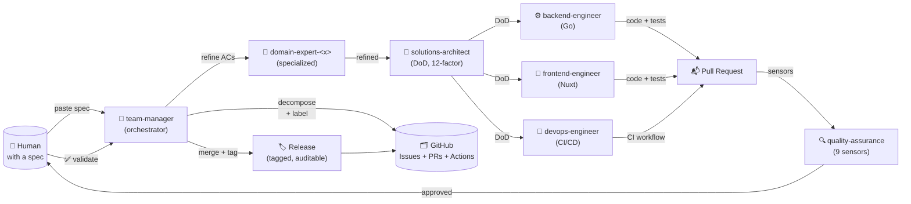
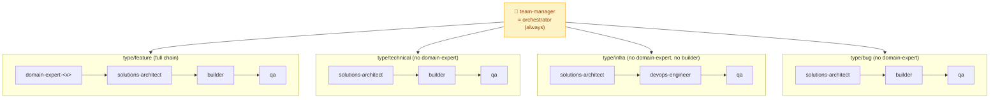
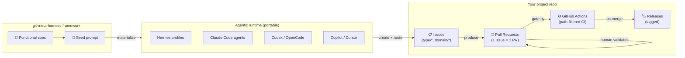
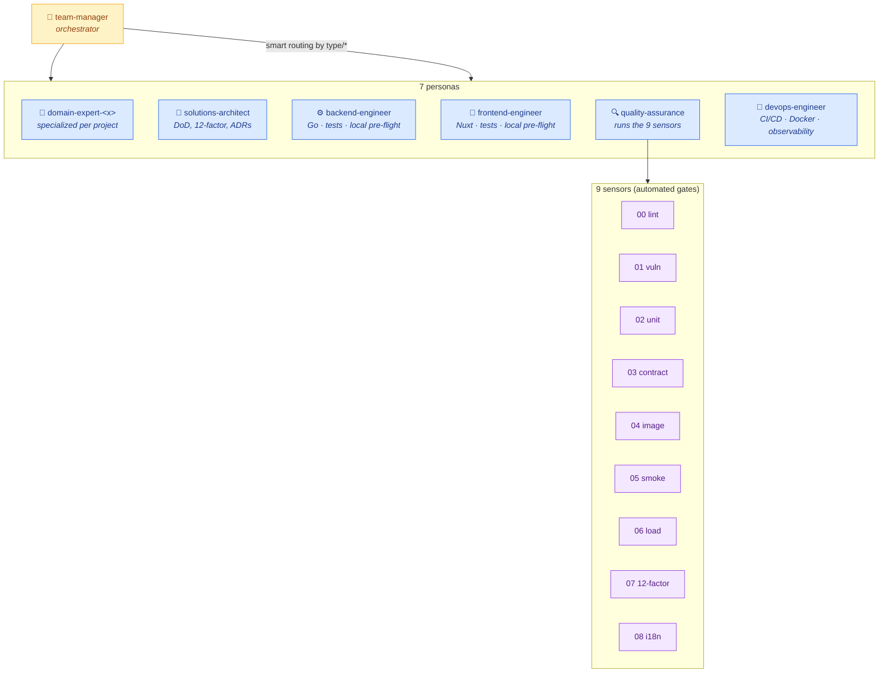
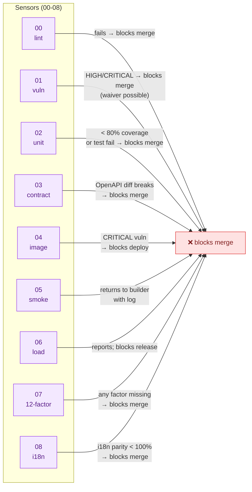
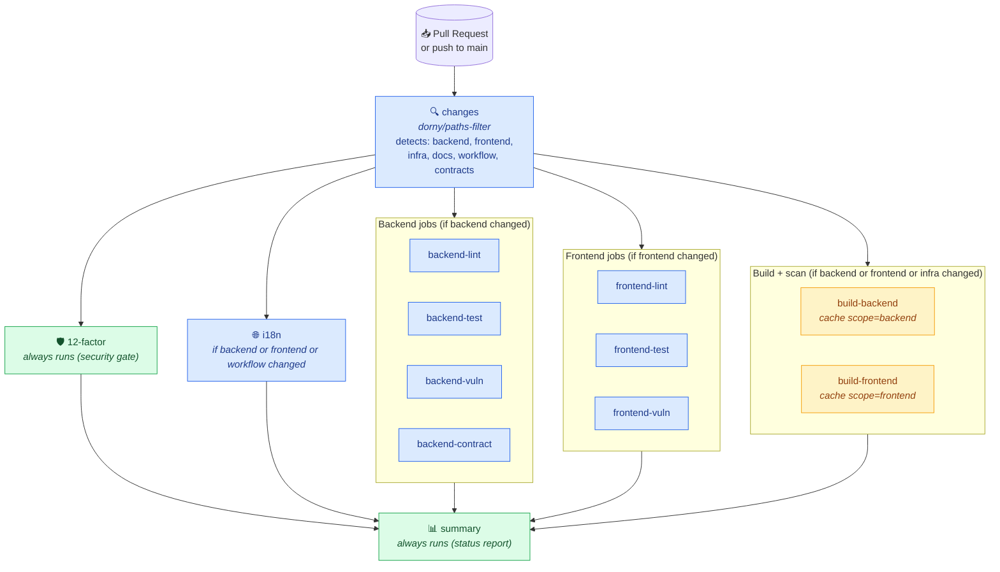

# git-meta-harness

> **Plug-and-play multi-agent orchestration framework for greenfield → production
> software delivery**, materializable on demand from a functional specification
> into any agentic CLI (Claude Code, Copilot, Codex, OpenCode, Devin, Hermes
> Agent, Cursor).
>
> **Version:** [1.0.0](./VERSION) · **License:** [MIT](./LICENSE) ·
> **Status:** stable · **Validated in production:** ✅
> [brenonaraujo/mandai-v2](https://github.com/brenonaraujo/mandai-v2)

---

## The concept in one paragraph

`git-meta-harness` is a **framework that materializes a reliable multi-agent
team + project + pipeline from a functional specification, with zero
configuration effort from the user**, using GitHub Issues + PRs + Actions as
the native substrate. It is called "meta" because it is the harness of
harnesses: the unit it delivers is not "one configured agent" but
"one orchestrated team, with process, gates, and audit trail". The user
pastes a spec into an agentic CLI; the `team-manager` decomposes the spec
into routed issues, dispatches them to specialized personas, gates the
work with 9 sensors + 18 invariants, and produces a PR ready for human
validation. **The user does not configure anything.** Full vision:
[`docs/CONCEPT.md`](./docs/CONCEPT.md). Comparison with SDD/SPDD:
[`docs/COMPARISON.md`](./docs/COMPARISON.md). Origin story:
[`docs/ORIGIN.md`](./docs/ORIGIN.md). GitHub integration:
[`docs/PIPELINE.md`](./docs/PIPELINE.md).

---

## Visual overview

### The full loop — from spec to release



**Reading the diagram:** the user pastes a spec; `team-manager`
decomposes it into labeled issues on GitHub; the smart router
dispatches each issue to the right persona chain; builders ship
code; QA runs 9 sensors on the PR; the human validates; the
release is tagged. **Zero configuration by the human.**

### The team — 7 personas + smart routing



**Reading the diagram:** `team-manager` is always present. The
`type/*` label on each issue picks one of the four paths. The
personas inside each path run **in sequence**, never all at once.

### GitHub as native substrate



**Reading the diagram:** the spec is the input; the seed
materializes the runtimes; the runtimes drive GitHub Issues;
Issues produce PRs; PRs are gated by modular CI; merges become
tagged Releases. **No new platform** is introduced.

---

## What is this

`git-meta-harness` is **a framework, not a product**. It defines a complete
orchestration layer for a **team of AI agents** that deliver software
projects from a **functional spec** to a **production release**, with:

- **7 personas** — team-manager, domain-expert (always specialized),
  solutions-architect, backend-engineer, frontend-engineer,
  quality-assurance, devops-engineer
- **9 sensors** — automated checks for static analysis, vulnerability,
  unit, contract, image scan, smoke, load, 12-factor, i18n
- **5 stack files** — Go 1.26.5 + Gin + GORM + PostgreSQL backend;
  Nuxt 4.5 + Pinia frontend; Prometheus + slog observability; distroless
  Docker; KISS/DRY code style
- **6 workflow docs** — issue-lifecycle, branching, PR, snapshot-deploy,
  release, orchestration
- **13 templates** — Dockerfile, docker-compose, CI workflow, .golangci.yml,
  .env.example, issue templates, PR description, 3 locales
- **7 skills** — github-pr-workflow, github-issues, github-code-review,
  tdd-go, openapi-spec-first, twelve-factor, i18n
- **18 invariants** in `AGENTS.md` §8 — non-negotiable contracts
- **10 ADRs** in `contrib/design-decisions.md` — every architectural
  decision documented

It's designed to be **dropped into any greenfield project** and produce
a consistent, auditable, CI-gated development loop with a real team
structure (not a "single agent does everything" anti-pattern).

## Why use it

| Without meta-harness                | With meta-harness                              |
|-------------------------------------|------------------------------------------------|
| One agent does everything → drift   | 7 personas with explicit roles & interactions  |
| No domain knowledge → generic AI    | Specialized `domain-expert-<domain>` per project |
| No tests, no CI gates               | 9 sensors, 12 invariants, smoke test pre-flight |
| Stack drift (Go 1.22 vs 1.26)       | `versions.md` + `check-stack-versions.sh`     |
| CI runs everything every time       | `dorny/paths-filter` → 5-10x faster PRs        |
| Vendor lock-in (Claude Code only)   | Multi-tool via `AGENTS.md` (Claude/Copilot/Codex/OpenCode/Devin/Hermes/Cursor) |
| No audit trail of decisions         | ADRs + 18 invariants + per-issue briefings     |
| No i18n → debt later                | i18n first-class (en, pt-BR, es)               |

## Quickstart

### 1. Use as the seed for a new project

The framework is **materialized** into a target project via the
[`meta-harness-seed.md`](./harness/seed/meta-harness-seed.md) prompt.
Copy that file's content into your agentic CLI of choice:

```bash
# Claude Code
cat harness/seed/meta-harness-seed.md | claude

# Hermes Agent
hermes -p team-manager

# Generic
# Paste into any chat-based agent and let it install the harness
# into the current project.
```

The team-manager will:
1. Read the spec (your functional requirements).
2. Detect the domain (banking, retail, logistics, …).
3. Create specialized `domain-expert-<domain>` if needed.
4. Decompose the spec into issues with the right `type/*` and
   `domain/*` labels.
5. Dispatch to personas in parallel with explicit briefings.
6. Validate each sub-issue, run sensors, gate the PR.
7. Block the merge until you, the human, validate.

### 2. Copy the harness to an existing project

```bash
# From your project root
git clone https://github.com/brenonaraujo/git-meta-harness.git /tmp/mh
cp -R /tmp/mh/harness ./harness
cp /tmp/mh/.github-workflows-ci.yml ./.github/workflows/ci.yml
cp /tmp/mh/.golangci.yml ./.golangci.yml
# ... adapt as needed
```

### 3. Verify it's healthy

```bash
./harness/scripts/smoke-test.sh .
./harness/scripts/check-stack-versions.sh --check-latest
# Both must report ✅ OK.
```

## Architecture overview

### The team (7 personas) and the 9 sensors



**Reading the diagram:** `team-manager` is the orchestrator. The
7 personas do the work. The QA persona runs the 9 sensors as
automated gates. Smart routing (shown above in "The team"
section) decides which personas run for which `type/*` issue.

### Sensors (when each runs, what happens on fail)



**Reading the diagram:** every sensor has a clear **fail action**.
8 of the 9 block the merge; sensor 06 (load) blocks the release
but not the merge. Sensor 04 (image) blocks the deploy.

### CI workflow (modular with path filters)



**Reading the diagram:** the `changes` job runs first and uses
`dorny/paths-filter` to detect which components changed. Then
only the relevant jobs run. 12-Factor and summary **always run**
(security gates). Backend/Frontend cache uses `scope=backend` /
`scope=frontend` so they don't invalidate each other. See
`docs/PIPELINE.md` and ADR-0011 for the full design.

## Multi-tool portability

The same `harness/` directory works in any agentic tool. The
[`AGENTS.md`](./harness/AGENTS.md) file is the universal contract; each
tool has a small adapter in §9:

| Tool         | Adapter path                  | Notes                          |
|--------------|-------------------------------|--------------------------------|
| Claude Code  | `CLAUDE.md` + `.claude/agents/`| Persona files → `.claude/agents/<name>.md` |
| GitHub Copilot | `.github/agents/` + `copilot-instructions.md` | |
| Codex CLI    | `AGENTS.md` (root)            | Direct, no adapter needed      |
| OpenCode     | `AGENTS.md` (root)            | Direct, no adapter needed      |
| Devin        | `AGENTS.md` + `.devin/`       |                                |
| Hermes Agent | `~/.hermes/profiles/<name>/SOUL.md` | Per-persona profile     |
| Cursor       | `.cursorrules`                | Generated from `AGENTS.md`     |

## Validated in production: mandai-v2

The framework was first validated end-to-end in
[**brenonaraujo/mandai-v2**](https://github.com/brenonaraujo/mandai-v2)
— a B2B2C community group buying marketplace (modeled on Meituan
Select / Duoduo Maicai), built with Hermes Agent.

**Project profile:**
- 4 issues, 5 commits, 1 PR (single-PR-per-feature).
- Stack: Go 1.25 + Gin + GORM + PostgreSQL + Nuxt 4 + Pinia + i18n
  (en/pt-BR/es).
- 9 real defects detected by the smoke test in the first pilot
  (Go version drift, `.golangci.yml` v1/v2 mix, distroless suffix,
  Trivy supply-chain risk, etc.) — all fixed in this v1.0.0.
- CI modular with `dorny/paths-filter`: PRs of typo/i18n-only run
  in ~30s (vs ~8 min for the full pipeline).

## Key principles (extracted from `bootstrap.md`)

1. **KISS, DRY, código limpo, ≤ 25/≤ 150.**
2. **TDD com table-driven tests + testify** (backend) / Vitest
   (frontend).
3. **OpenAPI spec-first** (never `swag`).
4. **12-factor obrigatório** (auditado pelo sensor 07).
5. **i18n first-class** (en, pt-BR, es).
6. **Domain-expert sempre especializado** (nunca genérico).
7. **Smart routing** por `type/*` no team-manager.
8. **team-manager NÃO escreve código de feature** (única linha
   vermelha).
9. **Local pre-flight** antes de PR (`make lint && make test &&
   make vuln`).
10. **Smoke test + check-stack-versions** rodados antes de
    processar issues.
11. **Stack pinada** (sem `latest`) — fonte canônica
    `stack/versions.md`.
12. **Distroless + UID 65532** (não `nonroot:nonroot`).
13. **Bootstrap from a seed** — cola o `meta-harness-seed.md` num
    agentic CLI e materializa o framework no projeto.

## Project structure

```
git-meta-harness/
├── README.md                    # this file
├── CHANGELOG.md                 # version history
├── LICENSE                      # MIT
├── CONTRIBUTING.md              # how to contribute
├── VERSION                      # semver (1.0.0)
├── .github/
│   ├── ISSUE_TEMPLATE/          # bug, feature, tech-debt
│   ├── PULL_REQUEST_TEMPLATE.md
│   └── CODEOWNERS
└── harness/
    ├── AGENTS.md                # multi-tool contract + 18 invariants
    ├── CLAUDE.md                # Claude Code adapter
    ├── bootstrap.md             # 13 princípios canônicos
    ├── smoke-test.md            # spec do smoke test
    ├── personas/                # 7 personas + examples/
    ├── sensors/                 # 9 sensors (00-08)
    ├── workflow/                # 6 workflow docs (00-05)
    ├── stack/                   # backend, frontend, observability,
    │                            #   docker, code-style, versions
    ├── templates/               # 13 templates (Dockerfile, ci.yml, ...)
    ├── skills/                  # 7 skills
    ├── contrib/                 # design-decisions.md (ADRs)
    ├── examples/                # domain-expert-* + README
    ├── seed/                    # meta-harness-seed.md
    └── scripts/                 # smoke-test.sh, check-stack-versions.sh
```

## Verification gates (pre-release)

```bash
# Smoke test (12 checks)
./harness/scripts/smoke-test.sh .

# Stack version consistency (offline + online)
./harness/scripts/check-stack-versions.sh --check-latest
```

Both must pass before any issue is processed. See
[`smoke-test.md`](./harness/smoke-test.md) for the full spec.

## Roadmap

- **1.0.0** ✅ — First public release (this version)
- **1.1.0** — Renovate/Dependabot config template (ADR candidate)
- **1.2.0** — E2E test strategy (Playwright + Go integration)
- **1.3.0** — Release automation (release-please config)
- **2.0.0** — Multi-repo orchestration (workspace of meta-harnesses)

## Contributing

See [`CONTRIBUTING.md`](./CONTRIBUTING.md). For major changes, open an
issue first to discuss what you'd like to change.

## License

[MIT](./LICENSE) — Copyright (c) 2026 Brenon Araujo.

## Acknowledgements

Built and validated with:

- [**Hermes Agent**](https://github.com/brenonaraujo/hermes) — the agentic
  CLI used in the pilot
- [Claude Code](https://claude.com/claude-code),
  [GitHub Copilot](https://github.com/features/copilot),
  [Codex CLI](https://github.com/openai/codex),
  [OpenCode](https://opencode.ai/),
  [Devin](https://devin.ai/),
  [Cursor](https://cursor.sh/) — multi-tool compatibility targets
- [golangci-lint v2](https://golangci-lint.run/),
  [Trivy](https://trivy.dev/),
  [dorny/paths-filter](https://github.com/dorny/paths-filter) — the
  CI/CD substrate
- [distroless](https://github.com/GoogleContainerTools/distroless) —
  the runtime substrate
- [Nuxt 4](https://nuxt.com/),
  [Go 1.26](https://go.dev/),
  [PostgreSQL 18](https://www.postgresql.org/) — the application stack
