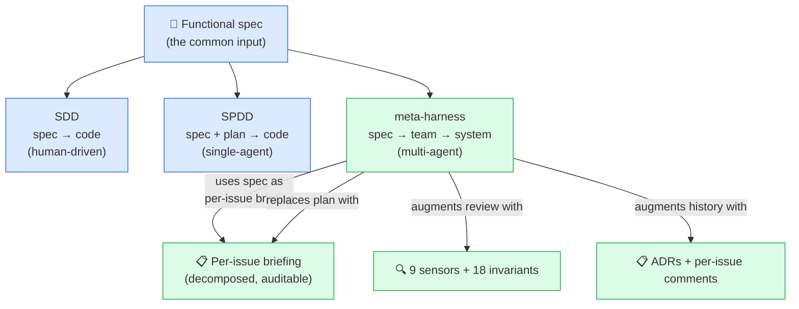

# Comparison — meta-harness vs SDD vs SPDD vs single-agent

> **TL;DR** — SDD writes code from a spec (human + AI assist).
> SPDD writes code from a spec + plan (single AI agent). The
> meta-harness writes a **system** from a spec using a **team of
> specialized AI agents** with routing, sensors, and audit trail.
> The unit of delivery is different in each case.

---

## 1. Quick reference table

| Aspect                          | **Single-agent**            | **SDD** (Spec-Driven)         | **SPDD** (Spec+Plan-Driven)        | **meta-harness**                    |
|---------------------------------|-----------------------------|--------------------------------|------------------------------------|-------------------------------------|
| **Input**                       | Vague prompt                | Spec document (`.md`/`.yaml`) | Spec + auto-generated plan         | Functional spec (free text or structured) |
| **Output**                      | Code (often inconsistent)    | Code written by human + AI suggestions | Code + plan | **Team + project + pipeline + ADRs** |
| **Who executes**                | 1 LLM (everything)          | Human + AI assist              | 1 AI agent (single brain)          | **Team of specialized AI agents** (`team-manager` orchestrates) |
| **Role separation**             | None (one agent, all roles) | None                           | None (still single agent)          | **7 personas, always specialized** (`domain-expert-<x>`) |
| **Routing by type of work**     | None                        | None                           | None                               | **Smart routing by `type/*`** (feature/technical/infra/bug/...) |
| **Gates**                       | None                        | Code review                    | Plan review + code review          | **9 sensors + 18 invariants + smoke test** |
| **Audit trail**                 | Chat history                | Git history                    | Plan + history                     | **ADRs + briefings + labels + sensors log** |
| **Reusability between projects**| Copy prompt                 | Copy spec + boilerplate        | Copy spec + plan template          | **Bootstrap from seed prompt** (1 paste, materializes) |
| **Where the spec lives**        | In the chat                 | In the repo                    | In the repo + in the plan          | **In the repo + in the ADRs + in the seed** |
| **Where the harness lives**     | In the agent's prompt       | N/A (no harness)               | In the agent's runtime config      | **In `harness/` of the meta-harness repo**, versioned |
| **Cost per project (setup)**    | Minutes                      | Hours (write spec, set up CI) | Hours (write spec, generate plan) | **Minutes (clone, materialize, go)** |
| **Cost per project (ongoing)**  | High (re-prompt, re-context)| Medium (human still in loop)   | Medium-high (single-agent limits)  | **Low (routing + sensors prevent rework)** |
| **Stack drift protection**      | None                        | None                           | None                               | **`check-stack-versions.sh --check-latest`** |
| **Multi-tool portability**      | Per-tool config             | Per-tool config                | Per-tool config                    | **`AGENTS.md` as universal contract** |
| **Failure mode**                | Agent loses context, hallucinations, drift | Spec becomes stale, no enforcement | Plan becomes stale, agent loses context | **Sensors catch it; human validation blocks merge** |

---

## 2. Why each step upward matters

The evolution from single-agent to meta-harness is driven by
**concrete pain points** at each step. Each level solves the
previous level's biggest failure mode and surfaces a new one.

### Single-agent → SDD

The first pain point is **the agent making things up**. The
human writes a spec; the agent reads it (sometimes) and writes
code that **plausibly matches** but actually contradicts the
spec.

SDD solves this by **making the spec the source of truth**. The
spec is checked in. The agent is told to read it. The human
reviews against the spec.

This is **necessary** but **not sufficient**:
- The spec becomes stale the moment the agent ships code that
  diverges from it.
- The spec is long; the agent does not always read it
  carefully.
- The human review is the only gate, and humans are
  inconsistent.

### SDD → SPDD

The next pain point is **planning**. The spec is necessary, but
**the path from spec to code is non-obvious** for anything
beyond a small feature. The agent invents a plan ("first do X,
then Y, then Z") and the plan is not visible to the human.

SPDD solves this by **making the plan explicit** and
**generating it from the spec**. The human reviews the plan
before the agent starts coding. This catches architectural
errors before they become code.

Still **not sufficient**:
- The plan is generated by the same single agent that will
  execute it. The plan reflects the agent's bias.
- The single agent is still doing all the roles (architect,
  coder, tester, reviewer). It is still going to be strong in
  some roles and weak in others.
- The plan does not survive agent failures (when the agent
  gets stuck, the plan is lost).

### SPDD → meta-harness

The next pain point is **scale and auditability**. As the
project grows:

- The single agent loses context. By 50 files, it is asking
  the same questions repeatedly.
- The single agent cannot be expert in all roles. A model
  good at writing Go is not necessarily good at negotiating
  with the user about a complex multi-tenant schema.
- The plan becomes hard to review. A monolithic plan for a
  3-month project is a document nobody reads.
- The audit trail collapses. When the agent makes a decision,
  you cannot tell why.

The meta-harness solves this by **splitting the single agent
into a team of specialized agents**, with a `team-manager` as
the orchestrator. The plan is replaced by **a per-issue
briefing**, which is small, specific, and auditable. The
sensors replace the human review (or augment it). The
invariants replace the (often ignored) coding standards doc.

---

## 3. The meta-harness is not "just" SPDD with more agents

A common objection is: "Isn't this just SPDD with multiple
agents? You have a spec, a plan, and an executor. The fact that
the executor is now a team of agents instead of one agent is
just an implementation detail."

It is not. The differences are structural:

1. **Role specialization is enforced, not optional.** In a
   multi-agent system without specialization, you can still end
   up with one agent doing everything (just with more
   bookkeeping). The meta-harness **requires**
   `domain-expert-<domain>` to be specialized; a generic
   `domain-expert` is a hard invariant violation.

2. **Routing is explicit and label-based.** The team-manager
   routes by `type/*` labels. A `type/infra` issue skips the
   `domain-expert` automatically. This is not a heuristic; it
   is a declared routing table.

3. **Gates are automated.** The sensors are not humans
   reviewing code; they are executable scripts that run in CI
   and block the merge. The 12-factor audit is not a
   checklist; it is a script that reads the repo and reports
   violations.

4. **The harness itself is the deliverable.** The meta-harness
   is not "a way to run SPDD with more agents". It is "a
   framework that, when applied to a project, produces a
   team + project + pipeline + audit trail, with the team
   being the primary deliverable".

5. **The harness is portable across tools.** The same
   `harness/` directory materializes as Hermes profiles,
   Claude Code agents, Codex CLI config, OpenCode config,
   Devin config, or Copilot config. The pattern survives
   the tool.

---

## 4. When to use which

Use **single-agent** when:
- The task is a one-off script, a small utility, or a "let me
  try this" experiment.
- The output is thrown away.
- Time-to-first-line is more important than long-term
  sustainability.

Use **SDD** when:
- You have a small project (≤ 10 files) with a single
  developer.
- The spec is small and stable.
- You are OK with manual code review as the only gate.

Use **SPDD** when:
- The project is medium-sized (10–100 files) with a few
  developers.
- The spec is non-trivial and the plan is the bottleneck.
- You want explicit planning before coding.

Use **meta-harness** when:
- The project is greenfield and you want a **repeatable
  process** that scales across multiple projects.
- The team includes AI agents (or will include them soon).
- You need a **pipeline + sensors + audit trail**, not just
  code.
- You want to **bootstrap from a spec, not from a stack
  decision**.
- You want to **port the workflow across agentic tools** as
  the ecosystem evolves.

---

## 5. Where SDD/SPDD and meta-harness connect

The meta-harness **does not reject SDD or SPDD**. It builds on
them:

- The **functional specification** is the same input SDD
  requires.
- The **plan** is replaced by a **per-issue briefing** that
  is generated by the `solutions-architect` (a persona) from
  the spec. The plan is decomposed, not generated monolithically.
- The **code review** is augmented by 9 sensors and 18
  invariants. Humans still review, but they review code that
  has already passed the automated gates.
- The **Git history** is augmented by ADRs, briefings, and
  per-issue comments.

If you are already doing SDD well, the meta-harness will make
your SDD **scale** to multi-agent, multi-service, multi-locale
projects without losing the spec-as-truth discipline.

If you are already doing SPDD with a single agent, the
meta-harness will give you **role separation, automated gates,
and audit trail** without forcing you to abandon your existing
spec.
