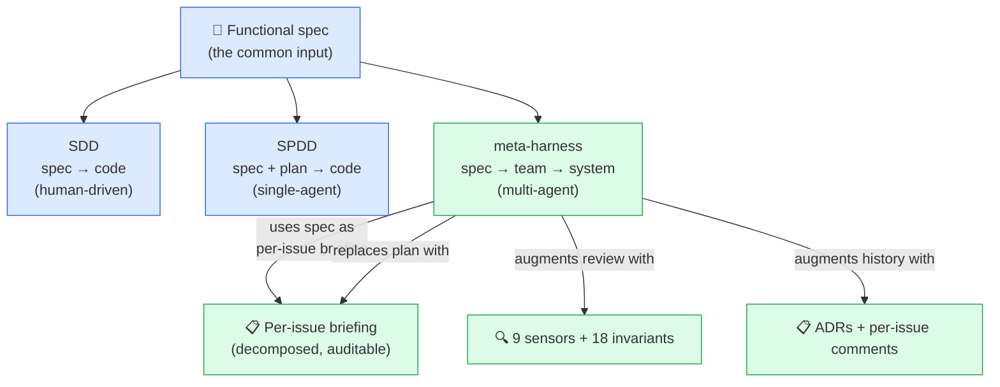
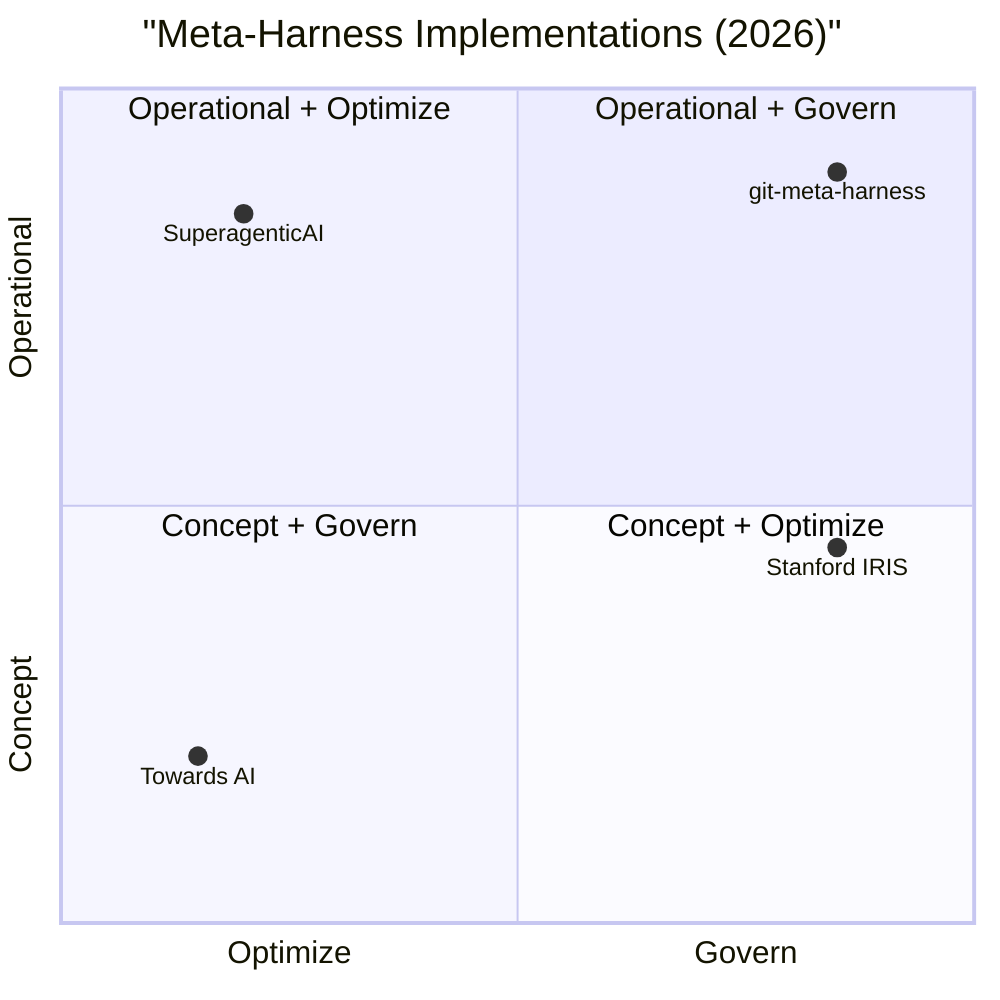

# Comparison — meta-harness vs SDD vs SPDD vs single-agent

> **TL;DR** — SDD writes code from a spec (human + AI assist).
> SPDD writes code from a spec + plan (single AI agent). The
> meta-harness writes a **system** from a spec using a **team of
> specialized AI agents** with routing, sensors, and audit trail.
> The unit of delivery is different in each case.

---

## 1. Quick reference table

| Aspect                          | **Single-agent**            | **SDD** (Spec-Driven)         | **SPDD** (Spec+Plan-Driven)        | **meta-harness**                    |
|---------------------------------|-----------------------------|--------------------------------|------------------------------------|-------------------------------------|
| **Input**                       | Vague prompt                | Spec document (`.md`/`.yaml`) | Spec + auto-generated plan         | Functional spec (free text or structured) |
| **Output**                      | Code (often inconsistent)    | Code written by human + AI suggestions | Code + plan | **Team + project + pipeline + ADRs** |
| **Who executes**                | 1 LLM (everything)          | Human + AI assist              | 1 AI agent (single brain)          | **Team of specialized AI agents** (`team-manager` orchestrates) |
| **Role separation**             | None (one agent, all roles) | None                           | None (still single agent)          | **7 personas, always specialized** (`domain-expert-<x>`) |
| **Routing by type of work**     | None                        | None                           | None                               | **Smart routing by `type/*`** (feature/technical/infra/bug/...) |
| **Gates**                       | None                        | Code review                    | Plan review + code review          | **9 sensors + 18 invariants + smoke test** |
| **Audit trail**                 | Chat history                | Git history                    | Plan + history                     | **ADRs + briefings + labels + sensors log** |
| **Reusability between projects**| Copy prompt                 | Copy spec + boilerplate        | Copy spec + plan template          | **Bootstrap from seed prompt** (1 paste, materializes) |
| **Where the spec lives**        | In the chat                 | In the repo                    | In the repo + in the plan          | **In the repo + in the ADRs + in the seed** |
| **Where the harness lives**     | In the agent's prompt       | N/A (no harness)               | In the agent's runtime config      | **In `harness/` of the meta-harness repo**, versioned |
| **Cost per project (setup)**    | Minutes                      | Hours (write spec, set up CI) | Hours (write spec, generate plan) | **Minutes (clone, materialize, go)** |
| **Cost per project (ongoing)**  | High (re-prompt, re-context)| Medium (human still in loop)   | Medium-high (single-agent limits)  | **Low (routing + sensors prevent rework)** |
| **Stack drift protection**      | None                        | None                           | None                               | **`check-stack-versions.sh --check-latest`** |
| **Multi-tool portability**      | Per-tool config             | Per-tool config                | Per-tool config                    | **`AGENTS.md` as universal contract** |
| **Failure mode**                | Agent loses context, hallucinations, drift | Spec becomes stale, no enforcement | Plan becomes stale, agent loses context | **Sensors catch it; human validation blocks merge** |

---

## 2. Why each step upward matters

The evolution from single-agent to meta-harness is driven by
**concrete pain points** at each step. Each level solves the
previous level's biggest failure mode and surfaces a new one.


### Single-agent → SDD

The first pain point is **the agent making things up**. The
human writes a spec; the agent reads it (sometimes) and writes
code that **plausibly matches** but actually contradicts the
spec.

SDD solves this by **making the spec the source of truth**. The
spec is checked in. The agent is told to read it. The human
reviews against the spec.

This is **necessary** but **not sufficient**:
- The spec becomes stale the moment the agent ships code that
  diverges from it.
- The spec is long; the agent does not always read it
  carefully.
- The human review is the only gate, and humans are
  inconsistent.

### SDD → SPDD

The next pain point is **planning**. The spec is necessary, but
**the path from spec to code is non-obvious** for anything
beyond a small feature. The agent invents a plan ("first do X,
then Y, then Z") and the plan is not visible to the human.

SPDD solves this by **making the plan explicit** and
**generating it from the spec**. The human reviews the plan
before the agent starts coding. This catches architectural
errors before they become code.

Still **not sufficient**:
- The plan is generated by the same single agent that will
  execute it. The plan reflects the agent's bias.
- The single agent is still doing all the roles (architect,
  coder, tester, reviewer). It is still going to be strong in
  some roles and weak in others.
- The plan does not survive agent failures (when the agent
  gets stuck, the plan is lost).

### SPDD → meta-harness

The next pain point is **scale and auditability**. As the
project grows:

- The single agent loses context. By 50 files, it is asking
  the same questions repeatedly.
- The single agent cannot be expert in all roles. A model
  good at writing Go is not necessarily good at negotiating
  with the user about a complex multi-tenant schema.
- The plan becomes hard to review. A monolithic plan for a
  3-month project is a document nobody reads.
- The audit trail collapses. When the agent makes a decision,
  you cannot tell why.

The meta-harness solves this by **splitting the single agent
into a team of specialized agents**, with a `team-manager` as
the orchestrator. The plan is replaced by **a per-issue
briefing**, which is small, specific, and auditable. The
sensors replace the human review (or augment it). The
invariants replace the (often ignored) coding standards doc.

---

## 3. The meta-harness is not "just" SPDD with more agents

A common objection is: "Isn't this just SPDD with multiple
agents? You have a spec, a plan, and an executor. The fact that
the executor is now a team of agents instead of one agent is
just an implementation detail."

It is not. The differences are structural:

1. **Role specialization is enforced, not optional.** In a
   multi-agent system without specialization, you can still end
   up with one agent doing everything (just with more
   bookkeeping). The meta-harness **requires**
   `domain-expert-<domain>` to be specialized; a generic
   `domain-expert` is a hard invariant violation.

2. **Routing is explicit and label-based.** The team-manager
   routes by `type/*` labels. A `type/infra` issue skips the
   `domain-expert` automatically. This is not a heuristic; it
   is a declared routing table.

3. **Gates are automated.** The sensors are not humans
   reviewing code; they are executable scripts that run in CI
   and block the merge. The 12-factor audit is not a
   checklist; it is a script that reads the repo and reports
   violations.

4. **The harness itself is the deliverable.** The meta-harness
   is not "a way to run SPDD with more agents". It is "a
   framework that, when applied to a project, produces a
   team + project + pipeline + audit trail, with the team
   being the primary deliverable".

5. **The harness is portable across tools.** The same
   `harness/` directory materializes as Hermes profiles,
   Claude Code agents, Codex CLI config, OpenCode config,
   Devin config, or Copilot config. The pattern survives
   the tool.

---

## 4. When to use which

Use **single-agent** when:
- The task is a one-off script, a small utility, or a "let me
  try this" experiment.
- The output is thrown away.
- Time-to-first-line is more important than long-term
  sustainability.

Use **SDD** when:
- You have a small project (≤ 10 files) with a single
  developer.
- The spec is small and stable.
- You are OK with manual code review as the only gate.

Use **SPDD** when:
- The project is medium-sized (10–100 files) with a few
  developers.
- The spec is non-trivial and the plan is the bottleneck.
- You want explicit planning before coding.

Use **meta-harness** when:
- The project is greenfield and you want a **repeatable
  process** that scales across multiple projects.
- The team includes AI agents (or will include them soon).
- You need a **pipeline + sensors + audit trail**, not just
  code.
- You want to **bootstrap from a spec, not from a stack
  decision**.
- You want to **port the workflow across agentic tools** as
  the ecosystem evolves.

---

## 5. Where SDD/SPDD and meta-harness connect

The meta-harness **does not reject SDD or SPDD**. It builds on
them:



- The **functional specification** is the same input SDD
  requires.
- The **plan** is replaced by a **per-issue briefing** that
  is generated by the `solutions-architect` (a persona) from
  the spec. The plan is decomposed, not generated monolithically.
- The **code review** is augmented by 9 sensors and 18
  invariants. Humans still review, but they review code that
  has already passed the automated gates.
- The **Git history** is augmented by ADRs, briefings, and
  per-issue comments.

If you are already doing SDD well, the meta-harness will make
your SDD **scale** to multi-agent, multi-service, multi-locale
projects without losing the spec-as-truth discipline.

If you are already doing SPDD with a single agent, the
meta-harness will give you **role separation, automated gates,
and audit trail** without forcing you to abandon your existing
spec.

---

## 6. Meta-Harness Implementations Compared (2026)

In 2026, **four parallel implementations** of "meta-harness"
emerged. They are **complementary, not competitive** — each
solves a different layer of the meta-harness problem.

### 6.1 Quick reference

| Aspect | **Stanford IRIS** (paper) | **SuperagenticAI** (code) | **Towards AI** (article) | **git-meta-harness** (this) |
|--------|---------------------------|---------------------------|--------------------------|------------------------------|
| **Type** | Academic research | Open-source code | Concept article | Operational framework |
| **What it does** | Optimizes harnesses via LLM | Builds 1 Python backend | Explains the why | Governs any project |
| **Substrate** | Python files | Python files | Article (text) | GitHub issues + PRs + Actions |
| **Tool** | Claude Code (proposer) | Custom Python runtime | n/a | Multi-tool (7) |
| **Stars** | 1.3k⭐ (127 forks) | 146⭐ (17 forks) | n/a (article) | n/a (newer, jul/2026) |
| **License** | MIT | Custom | n/a | MIT |
| **Self-optimizes** | ✅ YES (LLM proposer+verifier) | ❌ NO | n/a | ❌ NO (yet) |
| **Multi-tool** | ❌ NO (Claude only) | ❌ NO (custom) | n/a | ✅ YES (7 tools) |
| **Validation** | Paper (TACL-style) | Demo + repo | Concept only | **mandai-v2 (50+ issues, 4+ epics)** |
| **Year** | 2026 (arXiv:2603.28052) | v0.4.0 jun/2026 | jul/2026 article | v1.14.0 jul/2026 |
| **Authors** | Lee, Nair, Zhang, Lee, Khattab, Finn | SuperagenticAI | Abhishek Pan | Brenon Araujo + community |

### 6.2 What each does — and does NOT do

#### Stanford IRIS Lab (`stanford-iris-lab/meta-harness`)

> "Reference code for the Meta-Harness paper" — Yoonho Lee
> et al, arXiv:2603.28052, 2026.

**Focus**: research. Uses LLM-as-optimizer (proposer +
verifier) to **automatically generate and improve model
harnesses** for specific tasks (text classification, terminal-
bench-2, etc).

**Workflow**:
1. Read `ONBOARDING.md` + start conversation with proposer.
2. Proposer (Claude Code) generates `domain_spec.md`.
3. Verifier validates the spec against the task.
4. Harness is iterated until quality threshold met.

**What it does well**:
- Scientific rigor (1.3k stars, paper, MIT).
- Self-improving harness (the only one of the 4).
- Reusable across tasks (text_classification,
  terminal_bench_2 examples).

**What it does NOT do**:
- No multi-tool support (Claude Code only).
- No GitHub-native governance (operates on Python files
  in a research repo).
- No validation in production (research benchmark, not
  shipped product).

**Complementary to us**: Stanford IRIS could **optimize
git-meta-harness personas** in the future (LLM proposes
new domain-expert templates; verifier validates against
mandai-v2 issues).

#### SuperagenticAI/metaharness

> "Meta Harness Implementation" — v0.4.0 "Omnigent
> Backend", jun/2026.

**Focus**: implementation. A **concrete Python backend**
that runs a multi-agent system with a "harness" layer
above agents.

**Workflow**:
1. `pip install metaharness` (or clone).
2. Define agents in Python.
3. Backend orchestrates them with the harness rules.

**What it does well**:
- Concrete, runnable (146⭐, 17 forks, v0.4.0 tagged).
- Custom license (proprietary flavor — not MIT).
- Python-native (single ecosystem).

**What it does NOT do**:
- No GitHub-native governance (Python runtime, not
  GitHub substrate).
- No multi-tool (Python only).
- No validation in production (demo, not shipped
  product).

**Complementary to us**: SuperagenticAI's "Omnigent
Backend" could become **one of the agentic runtimes**
that git-meta-harness materializes to (alongside
Hermes, Claude Code, Codex, etc).

#### Towards AI (Abhishek Pan article)

> "What Is Meta-Harness for AI Agents and Why Now?" —
> jul/2026, 12.84 min read.

**Focus**: concept. Explains **why** meta-harness is
unavoidable in 2026, with the "Payal" fintech-engineer
narrative.

**Key quote**:

> "No gate stops it. No budget notices. No log can
> later tell her which agent touched what, with whose
> credentials, against which branch. On a weekend
> project, that is a funny story. In a regulated
> bank... it is a security incident."

**Pillars emphasized** (per the article's structure):
- **Governance**: who decides what an agent can do?
- **Audit**: what did each agent touch, with what
  credentials, against which branch?
- **Control plane**: single layer above all agents
  (not another agent, but governance).

**What it does well**:
- Articulates the problem crisply (3.3k words, 12.84 min).
- Uses concrete scenario (Payal at fintech, 9 AM, 5
  terminals).
- Quotes real practitioners (ex-Amazon, Databricks).

**What it does NOT do**:
- Not a product (it's an article, paywalled after
  preview).
- Doesn't propose a concrete implementation.

**Complementary to us**: Towards AI **describes the
problem space**; git-meta-harness is **one operational
answer** (multi-tool, GitHub-native, validated). The
"governance + audit + control plane" pillars are
exactly what our 13 sensors + 24 invariants + ADRs +
per-issue comments provide.

#### git-meta-harness (this project)

> Operational framework — multi-tool, GitHub-native,
> validated in mandai-v2.

**Focus**: governance. Provide a **GitHub-native
control plane** above any agentic tool.

**Workflow**:
1. `gmh install` or `gmh adopt` (project init).
2. Issues + PRs + comments are the substrate.
3. 13 sensors + 24 invariants run in CI and locally.
4. ADRs + per-issue comments provide audit trail.
5. `gmh doctor --json` provides health score.
6. `gmh metrics` provides dashboard.

**What it does well**:
- **Multi-tool** (7 agentics: Hermes, Claude Code, Codex,
  OpenCode, Copilot, Cursor, Devin).
- **GitHub-native** (issues + PRs + Actions — no custom
  runtime needed).
- **Validated in production** (mandai-v2, 50+ issues, 4+
  epics, 4 lessons applied as features).
- **Greenfield AND in-progress** (v1.14.0 adds
  `gmh adopt` for existing projects).
- **Spec → TODO** (v1.14.0 adds `gmh new --spec`).
- **Health score + metrics** (v1.14.0).

**What it does NOT do**:
- No LLM self-optimization (yet — could integrate with
  Stanford IRIS proposer in v2.0.0).
- Custom Python backend (we orchestrate via GitHub +
  agentic CLIs, not Python runtime).

### 6.3 Quadrant view



**Interpretation**:
- **git-meta-harness** is operational + governs (high
  on both).
- **SuperagenticAI** is operational but doesn't govern
  (no audit, no sensors).
- **Stanford IRIS** is research (concept-ish) + optimizes
  (its core competence).
- **Towards AI** is concept + governance talk (no
  implementation).

### 6.4 What we can learn from each

| From | Lesson we could apply (future) |
|------|--------------------------------|
| **Stanford IRIS** | LLM-as-optimizer to auto-generate `domain-expert-<novo-domínio>` from spec. Verifier validates against mandai-v2 issues. |
| **SuperagenticAI** | Their "Omnigent Backend" could become an **alternative agentic** alongside Hermes. We orchestrate; they run. |
| **Towards AI** | The "Payal narrative" is a great test case. We could add `gmh adopt --scenario fintech` that pre-configures the harness for regulated industries. |

### 6.5 What others can learn from us

- **Multi-tool orchestration** (Hermes + Claude Code +
  Codex + OpenCode + Copilot + Cursor + Devin) — Stanford
  IRIS and SuperagenticAI both lock to one runtime. Our
  `AGENTS.md`-as-universal-contract pattern is portable.
- **Sensors as enforcement** (13 sensors, 11 BLOCKING in
  v1.13.0) — research repos and Python backends don't have
  this kind of pre-merge gate.
- **Feature flow enforcement** (v1.13.0, sensor 13) —
  team-manager MUST go through domain-expert → architect
  → builder. No skip.
- **Per-issue audit trail** (ADRs + comments + labels) —
  full traceability from spec → epic → sub-issue → PR → release.
- **Validated in production** (mandai-v2, jul/2026) —
  not a paper, not a demo. Real 50+ issues, 4+ epics, 5
  lessons applied as features.

### 6.6 See also

- [`docs/ECOSYSTEM.md`](ECOSYSTEM.md) — full ecosystem
  map with diagrams, complements, and bridges.
- [Stanford IRIS paper (arXiv:2603.28052)](https://arxiv.org/abs/2603.28052 ([HTML](https://arxiv.org/html/2603.28052v1))).
- [SuperagenticAI/metaharness](https://github.com/SuperagenticAI/metaharness).
- [Towards AI article](https://pub.towardsai.net/what-is-a-meta-harness-in-ai-2af40e788c2e).

---

## 7. References (consolidated, v1.14.1+)

> All external sources cited in this document and
> `ECOSYSTEM.md`, in one place. Updated as the ecosystem
> evolves.

### 7.1 Papers and articles

| Source | Type | Year | Notes |
|---|---|---|---|
| **[Meta-Harness: End-to-End Optimization of Model Harnesses](https://arxiv.org/abs/2603.28052)** ([HTML v1](https://arxiv.org/html/2603.28052v1)) | Academic paper (arXiv:2603.28052) | 2026 | Lee, Nair, Zhang, Lee, Khattab, Finn (Stanford IRIS Lab). The original "meta-harness" concept. LLM proposer+verifier optimizes the harness. |
| **[What Is Meta-Harness for AI Agents and Why Now?](https://pub.towardsai.net/what-is-a-meta-harness-in-ai-2af40e788c2e)** | Industry article (Towards AI) | jul/2026 | Abhishek Pan. Governance + audit + control plane narrative. The "Payal" persona. |
| **[yoonholee.com/meta-harness](https://yoonholee.com/meta-harness/)** | Author site (Stanford IRIS) | 2026 | Companion site to the paper. |
| **[GitHub topic: llm-agents](https://github.com/topics/llm-agents)** | Topic index | — | Broader context for the meta-harness ecosystem. |
| **[GitHub topic: harness-engineering](https://github.com/topics/harness-engineering)** | Topic index | — | 70+ repos tagged (subset includes Stanford IRIS, SuperagenticAI). |

### 7.2 Repositories

| Repo | Type | License | Notes |
|---|---|---|---|
| **[stanford-iris-lab/meta-harness](https://github.com/stanford-iris-lab/meta-harness)** | Research code (Python 98%) | MIT | Reference code for the paper. Workflow: `ONBOARDING.md` → `domain_spec.md`. 1.3k⭐ 127 forks. |
| **[SuperagenticAI/metaharness](https://github.com/SuperagenticAI/metaharness)** | Production code (Python 100%) | Custom (proprietary) | v0.4.0 "Omnigent Backend" (jun/2026). 146⭐ 17 forks. |
| **[brenonaraujo/git-meta-harness](https://github.com/brenonaraujo/git-meta-harness)** | Operational framework (Go CLI + Markdown) | MIT | This project. v1.14.1 (jul/2026). Validated in mandai-v2. |
| **[brenonaraujo/mandai-v2](https://github.com/brenonaraujo/mandai-v2)** | Validation + test case (Go + Nuxt 4) | (per repo) | Multi-tenant B2B2C marketplace. The "real project" the framework is tested against. 50+ issues, 4+ epics, 5 lessons applied as features. |

### 7.3 Author / site

- **Yoonho Lee** (Stanford IRIS Lab) — [yoonholee.com](https://yoonholee.com/) ·
  [Stanford IRIS Lab](https://github.com/stanford-iris-lab).
- **Abhishek Pan** (Towards AI) — [@ai.pm.withabhi](https://medium.com/@ai.pm.withabhi).
- **Brenon Araujo** (this project) — [@brenonaraujo](https://github.com/brenonaraujo).
- **Mandaí v2 team** — pilot users / validation and test case.

### 7.4 Citation (BibTeX)

```bibtex
@misc{lee2026metaharnessendtoendoptimizationmodel,
      title={Meta-Harness: End-to-End Optimization of Model Harnesses},
      author={Yoonho Lee and Roshen Nair and Qizheng Zhang and Kangwook Lee and Omar Khattab and Chelsea Finn},
      year={2026},
      eprint={2603.28052},
      archivePrefix={arXiv},
      primaryClass={cs.AI},
      url={https://arxiv.org/abs/2603.28052},
}
```

