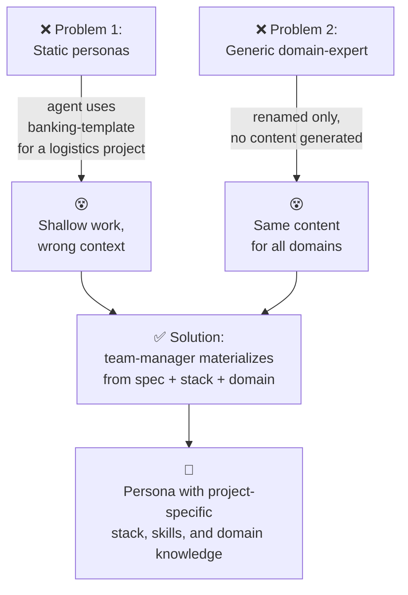
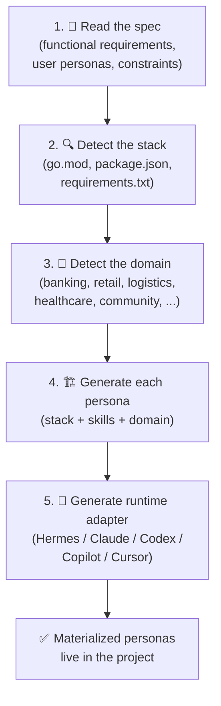

# The meta-harness concept

> **TL;DR** — `git-meta-harness` is a **framework that materializes a
> reliable multi-agent team + project + pipeline from a functional
> specification, with zero configuration effort from the user**, using
> GitHub Issues + PRs + Actions as the native substrate. It is called
> "meta" because it is the harness of harnesses: the unit it delivers
> is not "one configured agent" but "one orchestrated team, with
> process, gates, and audit trail."

---

## 1. The problem this exists to solve

Every team that tries to use AI agents for software delivery in
2026–2027 hits the same wall:

1. **One prompt, one agent, no role separation.** The same LLM is
   asked to be the architect, the backend coder, the QA, the devops
   engineer, and the project manager. Output quality drops in
   inverse proportion to the breadth of roles assigned to a single
   agent.

2. **No spec → no contract.** Either the human writes a vague prompt
   ("build me a marketplace") and the agent hallucinates an
   architecture, or the human spends days writing a spec that the
   agent barely reads.

3. **No process → no gates.** Without sensors, invariants, and CI
   gates, every PR is a leap of faith. Without smart routing, the
   team-manager routes every issue through every persona, wasting
   tokens and time.

4. **No audit trail.** When an agent makes a decision, you cannot
   tell why. When the same decision has to be re-made 6 months
   later, the context is gone.

5. **No reusability.** Every new project reinvents the wheel: pick a
   stack, write a Dockerfile, configure CI, set up issues, write
   personas, define the workflow. **Hours of boilerplate before the
   first line of business code is written.**

6. **Stack drift.** Go 1.22 in the Dockerfile vs 1.26 in the
   `go.mod`. `golangci-lint` v1 syntax with the v2 binary.
   `trivy-action@master` (mutable tag, supply-chain risk).
   distroless image without the `-debianX` suffix. Each of these
   costs hours to debug.

The meta-harness exists to **make all six of these go away by
default**, and to make the seventh (which we did not anticipate
until the pilot) go away too: **drift between what runs in your
local dev and what runs in CI**.

---

## 2. What the meta-harness actually is

A `git-meta-harness` repository contains:

- **A specification** (`harness/bootstrap.md`, `harness/AGENTS.md`):
  13 principles + 18 non-negotiable invariants.
- **A roster of personas** (`harness/personas/*.md`): 7 specialized
  roles, with a published `interactions.md` matrix of who can do
  what.
- **A roster of sensors** (`harness/sensors/*.md`): 9 automated
  checks (lint, vuln, unit, contract, image, smoke, load,
  12-factor, i18n) that gate every PR.
- **A workflow** (`harness/workflow/*.md`): the lifecycle of an
  issue, from triage to release, with branching strategy, PR
  conventions, and snapshot deploy.
- **A stack pinada** (`harness/stack/versions.md`): a single source
  of truth for every version of every dependency, validated online
  by `check-stack-versions.sh --check-latest`.
- **13 templates** (`harness/templates/`): Dockerfile,
  docker-compose, CI workflow, `.golangci.yml`, `.env.example`,
  issue templates, PR description, 3 locales.
- **7 skills** (`harness/skills/`): reusable skill bundles
  (GitHub workflow, i18n, twelve-factor, TDD, OpenAPI spec-first,
  code review, issues).
- **10 ADRs** (`harness/contrib/design-decisions.md`): every
  architectural decision documented and reversible.
- **2 executable scripts** (`harness/scripts/`):
  `smoke-test.sh` and `check-stack-versions.sh`, both runnable
  locally and in CI.
- **A seed prompt** (`harness/seed/meta-harness-seed.md`): a single
  prompt that, when pasted into any agentic CLI, instantiates
  the entire framework into a target project.

The output of the meta-harness, when applied to a project, is **a
team + a project + a pipeline + an audit trail** — not a scaffold,
not boilerplate, not a template folder. A working system.

---

## 3. What the meta-harness is NOT

- **It is not a scaffold.** A scaffold (`npx create-next-app`,
  `cookiecutter`, `degit`) generates a **project**. The meta-harness
  generates a **team that will produce more of the project over
  time**, with process.
- **It is not a code generator.** A code generator (Copilot, Cursor
  Tab) suggests code line by line. The meta-harness orchestrates
  roles, with briefs, with review, with gates.
- **It is not a single agent.** Single-agent systems (AutoGPT,
  LangChain agents, Codex CLI default) put one LLM in charge of
  everything. The meta-harness puts a **team-manager** in charge
  of a **team of specialized agents**, each with its own brief,
  model, and skills.
- **It is not tied to one tool.** The same `harness/` directory
  works with Claude Code, GitHub Copilot, Codex CLI, OpenCode,
  Devin, Hermes Agent, and Cursor. Tool-specific configuration is
  a thin adapter at `.claude/`, `.github/agents/`, `~/.hermes/`,
  etc.
- **It is not a finished product.** It is a **framework** that
  expects to be **instantiated per project** with a domain-expert
  specialized for that project's domain.

---

## 4. The input: a functional specification

The meta-harness does not start from "what language?" or "what
framework?". It starts from **what the system is supposed to do for
its users**:

> "We need a B2B2C marketplace where community leaders open buying
> rounds, residents join and pay via Pix, and suppliers fulfill
> orders. i18n: en, pt-BR, es. Multi-tenant by workspace. Multi-role
> per account (resident, leader, supplier, admin)."

The user pastes that into an agentic CLI together with the seed
prompt. The `team-manager`:

1. Detects the **domain** (community group buying, BR-Pix market).
2. Instantiates a specialized `domain-expert-mandai` (or whatever
   the domain is named).
3. Decomposes the spec into epics + sub-issues, with `type/*` and
   `domain/*` labels.
4. Dispatches each issue to the right persona (smart routing:
   `type/feature` goes through everyone; `type/infra` skips
   domain-expert and builder; etc.).
5. Each persona returns a brief that becomes a PR.
6. The QA persona runs all 9 sensors on the PR.
7. The team-manager blocks the merge until a human validates.
8. The human merges; the release workflow tags and publishes.

**Zero configuration was performed by the user.** The stack was
picked (Go 1.26.5, Nuxt 4.5, PostgreSQL 18.4) from the pinada
source. The CI was picked (modular workflow with `dorny/paths-
filter`). The i18n locales were picked (en, pt-BR, es). The
linters were picked. The Dockerfile pattern was picked. The
distroless base was picked. The branch protection was picked.

---

## 5. The output: a system, not a project

After the meta-harness runs once, the target project has:

- A working backend (Go + Gin + GORM + PostgreSQL) with
  `/healthz`, `/readyz`, `/metrics`, slog JSON logging, 12-factor
  config.
- A working frontend (Nuxt 4.5 + Pinia) with i18n, linted,
  type-checked, tested.
- A docker-compose that runs the whole stack locally with
  `make compose-up` and tears it down with `make compose-down`.
- A modular CI workflow that runs the right jobs for the right
  changes (5-10x faster on small PRs).
- A pinned stack with online drift detection.
- An audit trail: every issue has a brief, every PR has a DoD,
  every architectural decision is an ADR.
- And — crucially — **a process for the next change**. The next
  feature is not a new adventure; it is a new issue with a
  `type/*` label that the team-manager routes the same way.

---

## 6. The "meta" in meta-harness

The name is precise.

A **harness** is the configuration of one agent: which model, which
skills, which context, which tools, which system prompt.

A **meta-harness** is the configuration of the **harness-factory
itself**: which roles exist, which sensors gate which transitions,
which labels route which issues, which invariants cannot be
violated, which ADRs document which decisions, which templates
seed which projects, which seed prompt materializes which subset.

The meta-harness is **the contract that any agentic tool must
honor to be a member of the team**. When the `team-manager`
dispatches a `domain-expert` task to Claude Code, the
`.claude/agents/domain-expert-x.md` is generated from
`harness/personas/domain-expert.template.md` plus the domain
expertise file. When the same task is dispatched to Hermes
Agent, a profile is created with the same SOUL but using Hermes'
runtime. The **spec is the same**; the runtime is different.

---

## 7. How it differs from SDD and SPDD

See [`docs/COMPARISON.md`](./COMPARISON.md) for the full table.
The short version:

- **SDD** (Spec-Driven Development): a spec drives the code. The
  human still writes the code (with AI assist). The spec is
  usually a static document.
- **SPDD** (Spec & Plan-Driven Development): a spec + a plan
  drives a single AI agent. The plan is generated from the spec.
- **Meta-harness**: a spec drives a **team of specialized AI
  agents** (with routing, briefings, sensors, gates, audit trail)
  that produces a system. The "harness" of the team is itself
  generated from the spec.

The meta-harness is what you reach for when **SDD stops scaling**
(because one agent cannot be expert in everything) and **SPDD
stops being auditable** (because one agent's plan is hard to
review).

---

## 8. The GitHub substrate

The meta-harness deliberately does not introduce a new platform.
It uses GitHub as its native substrate:

- **Issues** = the work queue of the team.
- **PRs** = the unit of delivery.
- **Labels** = the routing mechanism (`type/*` and `domain/*`).
- **GitHub Actions** = the CI/CD substrate.
- **Branch protection rules** = the "human validation" gate.
- **CODEOWNERS** = the persona-owns-this responsibility matrix.
- **Releases + Tags** = the versioned, auditable output.
- **Discussions** (optional) = the place for roadmap and
  prioritization.
- **GitHub Projects** (optional) = the place for sprint planning.

Every pattern in the meta-harness is **a pattern that already
exists in GitHub**, applied with discipline. The meta-harness is
not "AI on top of GitHub" — it is "GitHub used the way it was
meant to be used, with AI agents as the workers".

---

## 9. Why this matters in 2026–2027

In the 18 months since the first agentic coding tools became
widely available (mid-2024), the field has learned:

1. **One agent cannot do it all** (proven by every codebase
   that tried).
2. **Spec-first is necessary but not sufficient** (proven by
   every codebase that has a `SPEC.md` nobody reads).
3. **CI gates are non-negotiable** (proven by every codebase
   that shipped a CVE in production).
4. **Process and audit trail are what make AI work
   sustainable** (proven by every team that tried to scale AI
   coding without process).

The meta-harness is the **opinionated synthesis** of these four
lessons, packaged as a bootstrap that you apply once per project.

The "meta" part is the most important: you are not configuring
agents; you are **teaching the system how to configure agents for
a new project, automatically, from a spec**.

That is the thing that scales.

---

## 10. Personas are **built on demand** for each project

A critical nuance: the personas in `harness/personas/` are
**templates**, not finished agents. When the seed is run on a
new project, the `team-manager` reads the project's context
(spec, detected stack, domain) and **generates specialized
personas** with content specific to that project.

### 10.0 The two problems solved by this distinction



**Reading the diagram:** the meta-harness solves two failure
modes by **forcing materialization** in the seed. The result
is a persona that knows the project's stack, skills, and
domain — without the user writing it.

### 10.1 Two layers, one source of truth

There are two layers in play, and confusing them is the most
common error:

| Layer | Where it lives | What it is |
|-------|----------------|------------|
| **Template** | `harness/personas/*.md` in this repo | Conceptual persona: principles, posture, what they do and don't do, what they deliver. Stable across projects. |
| **Materialized persona** | In the target project (e.g., `~/.hermes/profiles/<name>/SOUL.md`, `.claude/agents/<name>.md`, `.github/agents/<name>.md`) | Same persona, plus: the detected stack (Go 1.26.5, Nuxt 4.5, PostgreSQL 18.4), the in-context skills (GORM, Gin, golang-migrate, oapi-codegen, pnpm), the project name and domain knowledge, the runtime adapter. |

The invariant 12 ("domain-expert is always specialized") is not
just "rename the file". It is "**generate content specific to the
domain**". A `domain-expert-banking.md` that has the same content
as the template is a **failure**, not a success — it means the
materialization step was skipped.

### 10.2 The materialization step

When the `team-manager` runs the seed, the materialization step
performs the following:



1. **Reads the spec** (functional requirements, user personas,
   domain context, constraints).
2. **Detects the stack** (Go vs Node vs Python, PostgreSQL vs
   MongoDB, Gin vs Echo, Nuxt vs SvelteKit, etc. — either from
   the spec or from the existing repo files).
3. **Detects the domain** (banking, retail, logistics, healthcare,
   community group buying, etc.).
4. **Generates each persona** with the relevant context:
   - `backend-engineer` materialization knows the exact stack,
     has the right skills injected (GORM, gin, golang-migrate,
     oapi-codegen for a Go project; or Drizzle, Fastify, Prisma
     for a Node project), and references the right sensors.
   - `domain-expert-<domain>` materialization contains the
     domain knowledge extracted from the spec (regulatory
     framework, market dynamics, key entities, edge cases,
     known anti-patterns). This is the most domain-sensitive
     part.
   - `solutions-architect`, `quality-assurance`,
     `devops-engineer` get stack-specific guidance.
5. **Generates the runtime adapter** (Hermes profile, Claude
   Code agent, Codex config, etc.) from the materialized
   personas, not from the templates.

### 10.3 Skills are also injected dynamically

The `harness/skills/*.md` files are a **library base**. The
`team-manager` decides which skills each materialized persona
gets, based on the detected stack and domain:

- A Go project with PostgreSQL gets `tdd-go`,
  `golang-migrate-migrations`, `oapi-codegen-spec-first`,
  `twelve-factor-go`.
- A Node project with Nuxt + Pinia gets `tdd-vitest`,
  `pinia-stores`, `nuxt-i18n`, `twelve-factor-node`.
- A banking project adds `pix-cobranca`, `open-finance`,
  `lgpd-financial-data`.
- A logistics project adds `last-mile-routing`,
  `carrier-integration`, `sla-tracking`.

A new project does not need to write a single skill. The
materialization step injects the right subset from the library.

### 10.4 Where the materialized personas live

The materialized personas live in the **target project**, not in
the meta-harness repo. The relationship is:

```
git-meta-harness (this repo, versioned)
└── harness/personas/*.md         ← TEMPLATES (stable, reusable)
        │
        │  ← team-manager runs seed with spec
        │
        ▼
your-project (the target)
├── .claude/agents/*.md            ← MATERIALIZED for Claude Code
├── .github/agents/*.md            ← MATERIALIZED for Copilot
├── ~/.hermes/profiles/*/SOUL.md   ← MATERIALIZED for Hermes
└── .codex/agents/*.md             ← MATERIALIZED for Codex
```

When a new commit lands in `git-meta-harness` that improves a
template, the user can re-run the seed in their project to
**re-materialize** and pick up the improvements — without
losing the project-specific content (the materialization step
merges, it does not overwrite).

### 10.5 Why this distinction matters

If the framework shipped **finished personas**, every project
would either:
- (a) copy them as-is, getting shallow, generic work (the
  Mandaí v2 pilot bug that the smoke test caught: a generic
  `domain-expert` was used because no one materialized
  `domain-expert-mandai`), or
- (b) rewrite them by hand, undoing the value of the framework
  and creating a maintenance burden (every framework update
  becomes a manual merge).

By shipping **templates + a materialization step**, the
framework delivers the right trade-off: stable, reusable
templates on one side; project-specific, audit-traceable
content on the other.

This is the same pattern as a build system: the `Makefile` is
the template, the `make` invocation is the materialization
that produces a binary specific to the current code. The
meta-harness is a build system for **teams of agents**.

---

## 11. Anti-pattern: "I copied the personas, we're done"

A common failure mode is treating `harness/personas/*.md` as
finished. Symptoms:

- `domain-expert-banking.md` has the same content as
  `domain-expert.template.md` (only the filename changed).
- `backend-engineer` mentions "Go 1.26.5" but the project
  uses Python 3.12.
- The team-manager has to ask the human "what is the domain?"
  after the seed has been run, instead of inferring it from
  the spec.

If you see these, the materialization step was skipped. Re-run
the seed with the project's spec, and the personas will be
regenerated with project-specific content.

The meta-harness does not solve the "AI does the wrong thing"
problem if the AI skips the materialization. The smoke test
and the issue lifecycle check that it does not.

