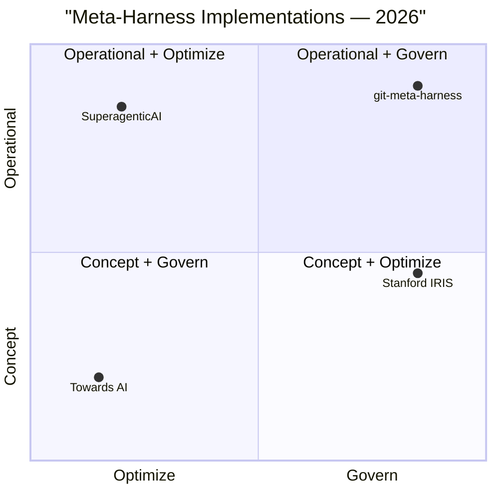
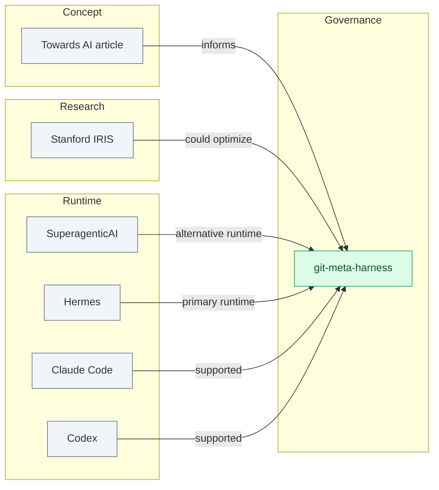

# Ecosystem — Meta-Harness Implementations (2026)

> **The meta-harness problem has at least four answers in
> 2026. This document maps the ecosystem, explains how
> each approach fits, and where the bridges might be.**

---

## 1. The four implementations

| # | Implementation | Type | Released | License | Stars |
|---|----------------|------|----------|---------|-------|
| 1 | **Stanford IRIS Lab** ([stanford-iris-lab/meta-harness](https://github.com/stanford-iris-lab/meta-harness)) | Research (paper + code) | 2026 (arXiv:2603.28052) | MIT | 1.3k⭐ |
| 2 | **SuperagenticAI/metaharness** ([SuperagenticAI/metaharness](https://github.com/SuperagenticAI/metaharness)) | Open-source code | v0.4.0 jun/2026 | Custom (proprietary) | 146⭐ |
| 3 | **Towards AI article** ([Abhishek Pan](https://pub.towardsai.net/what-is-a-meta-harness-in-ai-2af40e788c2e)) | Concept (article) | jul/2026 | n/a (paywalled) | n/a |
| 4 | **git-meta-harness** (this project, [brenonaraujo/git-meta-harness](https://github.com/brenonaraujo/git-meta-harness)) | Operational framework | v1.14.0 jul/2026 | MIT | n/a (newer) |

---

## 2. Quadrant view

**Reading the chart**:
- **X-axis (Optimize → Govern)**: does the implementation
  make harnesses *better* automatically, or does it *govern*
  existing harnesses?
- **Y-axis (Concept → Operational)**: is it a paper/article,
  or is it shipped + validated in production?

**Position of each**:
- **git-meta-harness**: high govern, high operational.
  Validated in mandai-v2 (50+ issues, 4+ epics).
- **SuperagenticAI**: high operational, low govern. Concrete
  Python backend, no audit trail.
- **Stanford IRIS**: high optimize, mid operational. LLM
  self-improves harness, but research benchmark.
- **Towards AI**: low on both. Concept only.

---

## 3. The four pillars each implementation emphasizes

**Reading the chart**: each implementation has a different
core loop. Stanford IRIS optimizes, SuperagenticAI runs,
Towards AI explains, git-meta-harness governs.

---

## 4. The complementarity matrix

| Pair | Are they complementary? | How? |
|------|------------------------|------|
| Stanford IRIS × git-meta-harness | ✅ YES | Stanford IRIS could **optimize our personas** (LLM proposes new domain-experts; verifier validates against mandai-v2 issues). |
| SuperagenticAI × git-meta-harness | ✅ YES | SuperagenticAI's "Omnigent Backend" could become **an alternative agentic runtime** alongside Hermes. We orchestrate; they run. |
| Towards AI × git-meta-harness | ✅ YES | Towards AI's pillars (governance + audit + control plane) are **exactly what our 13 sensors + 24 invariants + ADRs provide**. Their narrative is our roadmap. |
| Stanford IRIS × SuperagenticAI | ⚠️ Partial | Both Python-centric. Stanford could optimize SuperagenticAI's harness via LLM, but they overlap in ecosystem (Python runtime). |
| Stanford IRIS × Towards AI | ⚠️ Partial | Stanford is implementation; Towards AI is concept. Different audiences. |
| SuperagenticAI × Towards AI | ❌ Weak | SuperagenticAI doesn't address Towards AI's "audit + control plane" pillars. |

**Bottom line**: the four implementations **fit together**.
git-meta-harness is the operational layer; Stanford IRIS is
the optimizer; SuperagenticAI is a runtime option; Towards AI
is the narrative.

---

## 5. The bridges (v2.0.0 roadmap)

### 5.1 Bridge 1: Stanford IRIS as LLM-as-optimizer for personas

**Idea**: use Stanford IRIS's `proposer + verifier` loop to
auto-generate new `domain-expert-<novo-domínio>` templates.

**Workflow** (v2.0.0+, experimental):
1. Brenon writes a spec for a new domain (e.g., "logistics
   marketplace").
2. `gmh domain gen <spec>` invokes Stanford IRIS's proposer.
3. Proposer generates `domain-expert-logistics.md` candidate.
4. Verifier validates against mandai-v2 issues (does it pass
   sensor 13? Does it produce ACs?).
5. If valid, persona is added to `harness/personas/`.

**Status**: research idea. Could ship in v2.0.0 (2027).

### 5.2 Bridge 2: SuperagenticAI as alternative agentic runtime

**Idea**: let users choose **which agentic runtime** to
materialize the harness to. Today we have Hermes, Claude Code,
Codex, OpenCode, Copilot, Cursor, Devin. SuperagenticAI's
"Omnigent Backend" could be the 8th.

**Workflow** (v1.15.0+):
1. `gmh agents list-runtimes` shows 8 options.
2. `gmh agents install superagentic --profile team-manager`
   installs the persona to SuperagenticAI's runtime.
3. `gmh doctor --agent superagentic` validates.

**Status**: depends on SuperagenticAI exposing a public
profile spec. Could ship in v1.15.0 if they accept.

### 5.3 Bridge 3: Towards AI scenarios in `gmh adopt`

**Idea**: pre-configure the harness for scenarios from the
Towards AI article (Payal at fintech, 9 AM, 5 terminals).

**Workflow** (v1.15.0+):
1. `gmh adopt --scenario fintech` pre-loads:
   - `domain-expert-fintech.md` (with PCI-DSS, KYC, AML
     defaults).
   - Sensor 14 `compliance-check` (NEW: validates that
     every PR mentions the relevant regulation).
   - Skill `fintech-pii-handling` (NEW: redacts PII in
     logs, masks CPF/CNPJ, etc).
2. `gmh adopt --scenario healthtech` does the same for
   HIPAA-style projects.

**Status**: depends on scenarios being valuable. Could ship
in v1.15.0 if pilot shows demand.

---

## 6. Why this complementarity matters

In 2026, the meta-harness problem is **not solved by one
implementation**. It's solved by a **stack of implementations**:

1. **Concept layer** (Towards AI) — explains *why* meta-
   harness is unavoidable.
2. **Research layer** (Stanford IRIS) — generates *better*
   harnesses automatically.
3. **Runtime layer** (SuperagenticAI, Hermes, Claude Code)
   — *runs* the harness in a concrete environment.
4. **Governance layer** (git-meta-harness) — *governs* the
   harness via GitHub substrate.

Each layer is **insufficient alone**:
- A concept without runtime is just talk.
- A runtime without governance is chaos (Towards AI's
  "Payal" scenario).
- A governance without research is static (won't improve).
- A research without governance is ungrounded (paper vs
  production).

**git-meta-harness occupies the governance layer** — the
one that's **least replaceable** by research or runtime
advances, because governance is **boring but critical**.

---

## 7. Our position in 2026

**Key insight**: we're not competing with Stanford IRIS,
SuperagenticAI, or Towards AI. We're **the governance
substrate** that they all could plug into.

If Stanford IRIS ever ships a public "harness optimizer API",
we could be a client. If SuperagenticAI ever exposes a
"profile spec", we could be a consumer. If Towards AI writes
another article, we'll cite it.

**Our moat**: 50+ issues validated in mandai-v2 (jul/2026).
No other implementation has this.

---

## 8. See also

- [`docs/COMPARISON.md`](COMPARISON.md) — single-agent vs
  SDD vs SPDD vs meta-harness, plus the 4-way comparison
  (this document's narrower sibling).
- [Stanford IRIS paper (arXiv:2603.28052)](https://arxiv.org/abs/2603.28052).
- [SuperagenticAI/metaharness repo](https://github.com/SuperagenticAI/metaharness).
- [Towards AI article](https://pub.towardsai.net/what-is-a-meta-harness-in-ai-2af40e788c2e).
- `harness/contrib/design-decisions.md` ADR-0026
  (ecosystem positioning) + ADR-0029 (metrics).
