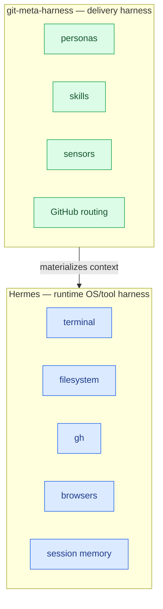
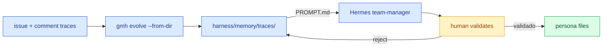

# Evolve — persona instantiate + issue-history self-improve

> **TL;DR** — Hermes is the runtime OS/tool harness.
> `git-meta-harness` is the delivery harness that
> **materializes** project-specific personas, skills,
> sensors, and GitHub routing. The output is context
> (agents / skills / tools) for **that** project.
> Domain-experts are never generic: they are created
> from project context at seed/adopt time. Personas
> and skills then improve on-demand from GitHub
> issue+comment history via `gmh evolve`. A human
> validates before persona files change.

---

## 1. Two harness layers

There are two harnesses. Mixing them up is the most
common way to over-scope this project.

| Layer | Role | Owns |
|---|---|---|
| **Hermes** | Runtime OS / tool harness | Terminal, filesystem, `gh`, browsers, session memory |
| **git-meta-harness** | Delivery harness | Materializes project-specific personas, skills, sensors, GitHub routing |

Hermes runs tools. `git-meta-harness` emits the
**delivery contract** those tools execute: which
personas exist, which skills they load, which sensors
gate a PR, how issues are routed. The output of
`gmh` is **context for that project**, not a second
agent runtime.



**Reading the diagram:** `gmh` does not replace Hermes
tools. Hermes does not decide which
`domain-expert-<x>` exists. Each layer stays in its
lane.

---

## 2. Dynamic domain-expert

Invariant (ADR-0003, `AGENTS.md` §8): **never a
generic `domain-expert`**. A profile named
`domain-expert` (no suffix) is refused. Profiles are
created from **project context** at seed / adopt time,
not from a canned generic expert.

```bash
gmh personas create --domain <x> --context "..."
gmh personas create --domain <x> --from-spec spec.md
```

`--from-spec` reads the spec file into the same
context string. The command writes
`harness/personas/domain-expert-<slug>.md` (kebab-case
ASCII slug) and appends a `## Project context`
section when context is non-empty. Empty /
`generic` / `domain-expert` as `--domain` values are
rejected.

Examples:

```bash
gmh personas create --domain banking --context "Pix + Open Finance"
gmh personas create --domain mandai --from-spec spec.md
gmh personas list
gmh personas remove domain-expert-banking
```

`remove` only deletes `domain-expert-*` files. The
template and adopter personas are never removed this
way.

---

## 3. Generated harness memory

`harness/memory/snapshot.json` is the **generated
harness memory**: which personas, skills, and Hermes
profiles exist for this project.

This is **not** Hermes session memory. Hermes
remembers conversations. The snapshot remembers what
the delivery harness materialized.

```bash
gmh memory write    # scan harness/ + optional Hermes home
gmh memory show     # print snapshot.json
```

Typical fields (`schema_version`:
`git-meta-harness/memory/v1`):

- `framework_version`, `generated_at`, `runtime`
  (`hermes` | `claude-code` | `none`)
- `project`
- `personas[]`, `skills[]`, `hermes_profiles[]`
- `notes` — Hermes = OS/tool harness; this snapshot =
  delivery-harness memory

---

## 4. Evolve loop (Stanford analog)

Stanford Meta-Harness
([arXiv:2603.28052](https://arxiv.org/abs/2603.28052))
keeps a **filesystem of candidate model-harnesses +
traces** and runs an LLM proposer against them.

`git-meta-harness` keeps the same *shape* on the
**governance** side. It does **not** call Stanford's
Python proposer. It does **not** treat an LLM as an
optimizer of harness code.

| Stanford IRIS | git-meta-harness (v1.15.0) |
|---|---|
| Filesystem of candidate model-harnesses + traces | `harness/memory/traces/` of GitHub issue comments |
| LLM proposer mutates harness code | `gmh evolve` writes `proposal.md` + `PROMPT.md` for the Hermes team-manager |
| Verifier against a task benchmark | Human validates before persona files change |

`gmh evolve --from-dir DIR` is deterministic. It
loads comment fixtures (`*.json` objects, or a
`comments.json` array), quotes snippets that mention
AC / DoD / skill gaps, and writes a proposer prompt
the Hermes team-manager (or any agentic runtime) can
run. Personas and skills improve **on-demand** from
issue+comment history.

`--apply` writes `harness/memory/traces/<utc>/` only
(`comments.json`, `proposal.md`, `PROMPT.md`). It
does **not** overwrite persona files. The human still
validates before those files change.



**Stop condition:** the loop stops when the human
comments `validado` (or equivalent) on the proposal.
Until then, persona files stay untouched.

---

## 5. How to run

```bash
# 1. Instantiate a specialized domain-expert from
#    project context (never generic).
gmh personas create --domain banking --context "Pix + Open Finance"
# or
gmh personas create --domain banking --from-spec spec.md

# 2. Persist generated-harness memory
#    (which personas / skills / profiles exist).
gmh memory write

# 3. Propose persona/skill patches from issue+comment
#    fixtures. --apply writes traces only.
gmh evolve --from-dir ./fixtures --apply
```

Then open `harness/memory/traces/<utc>/PROMPT.md` in
the Hermes team-manager. After the human validates,
edit persona / skill files.

Operational playbook for the team-manager:
[`harness/workflow/08-persona-evolve.md`](../harness/workflow/08-persona-evolve.md).

---

## 6. See also

- ADR-0030 in
  [`harness/contrib/design-decisions.md`](../harness/contrib/design-decisions.md)
  — persona instantiate + evolve from issue traces.
- ADR-0003 — `domain-expert` is always specialized.
- [`docs/LOOP.md`](LOOP.md) §10 — verifier + memory
  now include persona evolve.
- [`docs/ECOSYSTEM.md`](ECOSYSTEM.md) §5.1 — Stanford
  bridge on the governance side.
- [Stanford IRIS paper (arXiv:2603.28052)](https://arxiv.org/abs/2603.28052)
