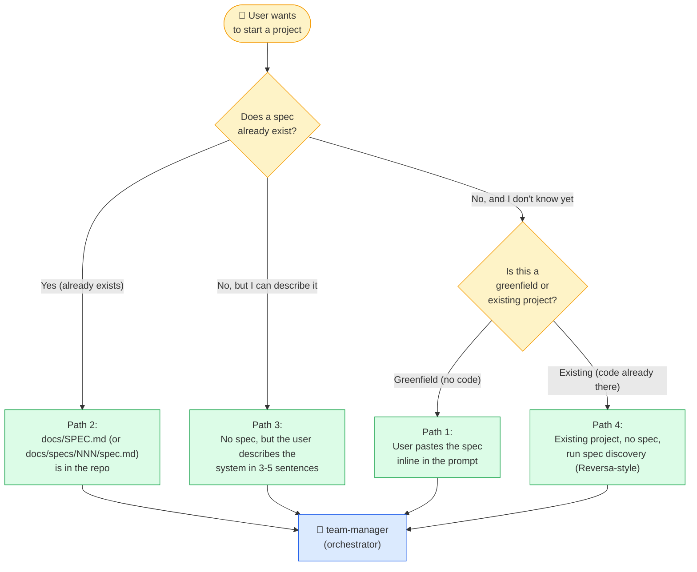
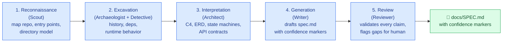
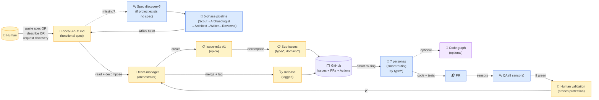

# HOWTO — start a project with the meta-harness

> **TL;DR** — the meta-harness takes a **functional spec** as
> its input. Where the spec lives depends on whether the
> project is **greenfield** (no code yet) or **existing** (code
> already there). The `team-manager` is the persona that
> handles spec discovery automatically.

---

## 1. The single input: a functional spec

The meta-harness does not start from "what language?" or
"what framework?". It starts from **what the system is
supposed to do for its users**. That description — written
in plain text, structured or not — is the **functional
spec** that drives everything.

A spec is a document that answers:

- **What problem** does the system solve?
- **Who are the users** (roles, personas, contexts)?
- **What are the 3-5 most important features** of the MVP?
- **What are the constraints** (compliance, integration,
  performance, security)?
- **What is explicitly out of scope** for the MVP?

A spec is **not**:

- A technical architecture (that's what `solutions-architect`
  produces from the spec).
- A list of tasks (that's what the `team-manager` produces
  from the spec).
- A documentation of code (that's what `check-stack-versions`
  and the ADRs do).

---

## 2. Where the spec lives (4 paths)

There are **4 valid paths** to provide a spec, and the
`team-manager` handles all of them.



**Reading the diagram:** all 4 paths converge on the same
artifact — a `docs/SPEC.md` (or `docs/specs/NNN-*/spec.md`)
in the repo. The `team-manager` then reads the spec and
decomposes it into issues.

### Path 1 — User pastes the spec inline in the prompt

The most common path. The user opens the agentic CLI and
writes something like:

> "I'm building a B2B2C community group buying marketplace
> called Mandaí. Community leaders open buying rounds,
> residents join and pay via Pix, suppliers fulfill orders.
> i18n: en, pt-BR, es. Multi-tenant by workspace, multi-role
> per account (resident, leader, supplier, admin). What's the
> first issue we should open?"

The `team-manager`:

1. Parses the description into a structured spec.
2. Writes it to `docs/SPEC.md` (greenfield) or
   `docs/specs/000-mandai/spec.md` (named feature).
3. Proceeds with the loop.

### Path 2 — A spec already exists in the repo

If the user already maintains a `docs/SPEC.md` (or
`docs/specs/NNN-*/spec.md`), the `team-manager` reads it
directly. This is the most common case for projects that
have been running the meta-harness for a while.

**Recommended layout:**

```
docs/
├── SPEC.md                            # product-level spec
└── specs/                             # feature-level specs
    ├── 001-mandai-bootstrap/
    │   ├── spec.md                    # what + why
    │   ├── plan.md                    # how (DoD, ADRs)
    │   └── tasks.md                   # decomposed tasks
    ├── 002-roles-and-tenants/
    │   ├── spec.md
    │   └── ...
    └── ...
```

### Path 3 — No spec, but the user can describe the system

The `team-manager` asks 3-5 clarifying questions, then
writes the spec itself based on the answers. The user
validates the spec in a PR before any feature work starts.

### Path 4 — Existing project, no spec (spec discovery)

The hardest path. The project already has code but no
documented spec. The `team-manager` runs a **spec discovery
pipeline** (see §3 below) that:

1. Maps the repository surface.
2. Analyzes modules, history, deprecated paths.
3. Extracts implicit business rules.
4. Synthesizes the architecture.
5. Writes the spec with confidence markers.
6. Validates with the user.

---

## 3. Spec discovery for existing projects (Reversa-style)

When the project already has code but no spec, the
`team-manager` runs a **5-phase spec discovery pipeline**
inspired by the [Reversa framework](https://github.com/sandeco/reversa)
(Macedo & da Costa, May 2026 — arXiv:2605.18684). The output
is a `docs/SPEC.md` (or `docs/specs/000-*/spec.md`) with
**confidence markers** on every claim.



**Reading the diagram:** 5 phases, each with a specialized
"sub-agent" role. The output is a spec with **confidence
markers**:

- 🟢 **CONFIRMED** — claim is directly verified in code
  (e.g., the `users` table has a `phone` column).
- 🟡 **INFERRED** — claim is deduced but not directly
  verified (e.g., "users are uniquely identified by
  phone" — true in most rows, but maybe not enforced).
- 🔴 **GAP** — important area with no clear evidence
  (e.g., "the rate limit is 100 req/s" — not enforced in
  code; needs human to confirm).

The user reviews the spec, fixes the 🟡 and 🔴, and merges
it. **Only then does feature work start.**

### 3.1 How the meta-harness implements this

The meta-harness does **not** ship the Reversa tool itself
(it is an external dependency). Instead, the `team-manager`
briefing includes the 5-phase pipeline as a procedural
script. The actual sub-agents are the existing meta-harness
personas:

| Reversa role       | Meta-harness persona that fills the role |
|--------------------|--------------------------------------------|
| Scout              | `team-manager` (initial triage)           |
| Archaeologist      | `domain-expert-<x>` (history mining)      |
| Detective          | `backend-engineer` (code-level analysis)  |
| Architect          | `solutions-architect` (synthesizes the model) |
| Writer             | `team-manager` (drafts the spec)           |
| Reviewer           | `quality-assurance` (validates, flags gaps) |

To run the discovery, the user invokes the `team-manager`
with the message:

> "I have an existing project at `<path>`. Run the spec
> discovery pipeline (5 phases) and produce
> `docs/SPEC.md` with confidence markers."

The `team-manager` orchestrates the sub-personas in
sequence, just like a regular issue, but the deliverable
is **a spec, not a feature**.

### 3.2 The discovery is never "done"

Even after a spec exists, the `team-manager` keeps it
up-to-date. When a new feature is implemented that changes
the spec (e.g., a new entity is added), the
`solutions-architect` updates the spec in the same PR. The
spec is a **living document**, versioned with the code.

---

## 4. The full loop, with spec discovery



**Reading the diagram:** the user provides the spec (4 paths
in §2). The `team-manager` decomposes it into issues on
GitHub. The 7 personas execute, with an optional code graph
to speed up discovery. The PR is gated by 9 sensors and
the human's validation. The release is tagged.

---

## 5. The code graph: an optional accelerator

For **large or unfamiliar codebases**, the meta-harness
recommends activating a **code graph** alongside the
personas. A code graph is a pre-indexed map of the
codebase's architecture (files, classes, functions,
imports, calls) that lets the personas answer
"where does X live?" and "what calls Y?" in **one
query instead of 30**.

### 5.1 Why a code graph

The 2026 benchmark results (CodeCompass, CodeGraph):

- **94% fewer tool calls** when navigating a large codebase.
- **77% faster** end-to-end task completion.
- **20 percentage points** improvement in "hidden-dependency
  tasks" (where critical files are structurally connected
  but semantically distant) — 99.4% architectural coverage.

Without a code graph, the personas have to rely on
**agentic search** (grep + read + follow references), which
is correct but slow for unfamiliar code.

### 5.2 Compatible tools (3 philosophies)

The meta-harness is **code-graph-agnostic** but recommends
one of the following at the seed step:

| Philosophy | Tool | When to use | Cost |
|---|---|---|---|
| **Index-first** | Sourcegraph (Cody MCP), Cursor codebase indexing, Augment | Enterprise, very large codebases, organizational scale | Sourcegraph enterprise license / Cursor paid tier |
| **Agentic search** | (default) | Small/medium codebases, fast iteration | Free (built into Claude Code, Hermes, etc.) |
| **Hybrid graph-augmented** | CodeCompass (Neo4j), CodeGraph (local SQLite + tree-sitter) | Need both speed and depth, willing to run a local server | CodeGraph is free; CodeCompass open-core |

The meta-harness does **not** ship a code graph server. The
personas can use any of the above, or none at all. The
seed script has a section for **optional code graph setup**.

### 5.3 The pattern: semantic search first, grep second

When a persona needs to find something in a codebase:

1. **First**, try the **code graph** (or vector semantic
   search if a code graph is not available). Query:
   "where is the user authentication handled?"
2. **Then**, fall back to `gh` + `grep` for exact
   identifiers.

This is documented in the personas as a **rule of thumb**:
"**code_search before grep**" (semantic first, exact
second).

---

## 6. Step-by-step: your first project with the meta-harness

### Greenfield (no code yet)

1. `git clone https://github.com/brenonaraujo/git-meta-harness.git /tmp/mh`
2. `mkdir my-project && cd my-project && git init`
3. `cp -R /tmp/mh/harness ./harness`
4. `cp /tmp/mh/templates/.github-workflows-ci.yml ./.github/workflows/ci.yml`
5. `cp /tmp/mh/templates/.golangci.yml ./.golangci.yml`
6. `cp /tmp/mh/templates/.env.example ./.env.example`
7. Open the agentic CLI (Hermes, Claude Code, etc.).
8. Paste the spec (Path 1) or describe the system (Path 3).
9. The `team-manager` materializes the personas, creates
   `docs/SPEC.md` if needed, and opens the first issue.
10. Validate the first PR, then iterate.

### Existing project (code already there, no spec)

1. Same as greenfield, steps 1-7.
8. Tell the `team-manager`: *"Run the spec discovery pipeline
   on this repo and produce `docs/SPEC.md` with confidence
   markers."*
9. The `team-manager` orchestrates the 5-phase pipeline
   (see §3). It produces `docs/SPEC.md` with 🟢 / 🟡 / 🔴 markers.
10. You review the spec, fix the 🟡 and 🔴 in a PR, merge.
11. Now feature work can start (the loop runs as usual).

### Existing project (code already there, with spec)

1. Same as greenfield, steps 1-6.
8. Drop your spec at `docs/SPEC.md`.
9. Tell the `team-manager`: *"Read `docs/SPEC.md` and open
   the first issue."*
10. The `team-manager` decomposes the spec, opens issues,
    and the loop runs as usual.

---

## 7. Anti-patterns to avoid

- **"I'll add the spec later."** The spec is the input. No
  spec, no loop. If you don't have a spec, the
  `team-manager` will help you write one.
- **"I'll just describe the system in the prompt and
  skip the spec file."** This works once; it does not scale
  to multiple issues or multiple team members. Always write
  the spec to `docs/SPEC.md`.
- **"The spec is in Confluence / Notion / somewhere else."**
  Confluence is not versioned with the code, and the
  agentic CLIs cannot read it directly. The spec must be
  in the repo (or in a location the agent can access, e.g.,
  a public URL that the agent fetches).
- **"I'll let the agent figure out the spec by reading the
  code."** That is the spec discovery pipeline, and it is
  one of the 4 valid paths. Do not skip it and pretend the
  agent just "knows" what to do.
- **"I'll write a 50-page spec."** A spec should be 1-3
  pages. If it's longer, it's an architecture document, not
  a spec. Split it into `docs/specs/NNN-*/spec.md` per
  feature.
