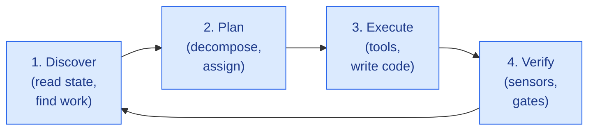
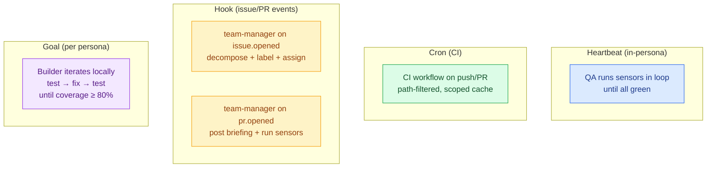
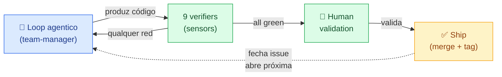
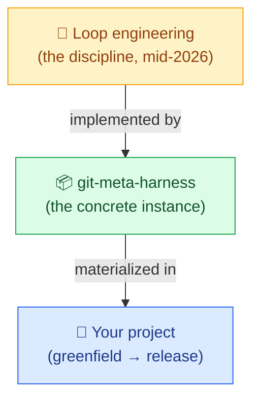

# Loop engineering — how git-meta-harness fits

> **TL;DR** — `git-meta-harness` is a concrete, ship-now
> implementation of **loop engineering** for the case of
> greenfield software delivery. Where loop engineering says
> "design the loop", the meta-harness says "this is the loop,
> these are the 9 verifiers, these are the 7 personas, this is
> the stack, plug the spec here". The user does not design
> the loop; the user pastes the spec.

---

## 1. What is loop engineering (2026)

The term **loop engineering** crystallized in mid-2026 (Addy
Osmani, IBM Think, AI Builder Club, and many practitioners) with
a central thesis:

> **You do not prompt the agent. You design the system that
> prompts the agent.**

The unit of work is no longer "one conversation" or "one
prompt". It is a **loop**: a repeating cycle in which the model
takes an action, receives feedback, decides the next move, and
continues until a defined termination condition is met.



### Four canonical loop types

| Type | Cadence | Use case |
|---|---|---|
| **Heartbeat** | seconds–minutes | continuous monitoring, log watching, drift detection |
| **Cron** | scheduled | daily code review, weekly dependency audits, morning standup summaries |
| **Hook** | event-driven | PR opened, CI failed, webhook arrived |
| **Goal** | until termination | refactoring, bug hunting, migrations of unknown scope |

### The 5 building blocks + 1 memory (Osmani)

1. **Automations** — the scheduling layer (cron, webhooks).
2. **Worktrees** — parallel execution without stepping on each
   other.
3. **Skills** — markdown-injected project knowledge.
4. **Plugins / Connectors** — tool integration via MCP, APIs.
5. **Sub-agents** — role separation (one has the idea, another
   checks it).
6. **Memory** — state outside the single conversation
   (markdown file, Linear board, GitHub issues).

### The verifier is the bottleneck

Every practitioner agrees: the model is not the bottleneck. The
**verifier** (the thing that decides "is this done?") is. A
weak verifier means a loop that never stops, or that stops
on the wrong thing. Loop engineering is **80% writing good
verifiers + stop conditions** and **20% the model itself**.

---

## 2. How git-meta-harness maps to loop engineering

The meta-harness is **a concrete, ship-now implementation** of
loop engineering for greenfield software delivery. The
mapping is direct:

| Loop engineering concept | git-meta-harness equivalent |
|---|---|
| **Automations** (scheduling) | GitHub Actions (cron, push, PR trigger) |
| **Worktrees** (parallel work) | Branches `feature/<id>-<slug>` per issue; multiple builders in parallel |
| **Skills** (project knowledge) | `harness/skills/*.md`, materialized per persona at seed time |
| **Connectors** (tool integration) | GitHub Issues + PRs + Actions + Releases as substrate; agent-specific runtimes (Hermes, Claude Code, Codex, Copilot, Cursor) |
| **Sub-agents** (role separation) | **7 personas** with smart routing by `type/*` labels |
| **Memory** (state outside conversation) | **GitHub Issues** (per-issue briefing) + **ADRs** in `harness/contrib/design-decisions.md` + **`versions.md`** (pinned stack) + **18 invariants** in `AGENTS.md` §8 |

```mermaid
flowchart TB
    subgraph LE["🔁 Loop engineering (discipline)"]
        L1[Automations]
        L2[Worktrees]
        L3[Skills]
        L4[Connectors]
        L5[Sub-agents]
        L6[Memory]
    end

    subgraph MH["📦 git-meta-harness (concrete instance)"]
        M1[GitHub Actions]
        M2[feature/&lt;id&gt;-&lt;slug&gt; branches]
        M3["harness/skills/*.md<br/>(materialized per persona)"]
        M4[GitHub Issues/PRs/Releases<br/>+ Hermes/Claude/Codex]
        M5[7 personas + smart routing]
        M6[Issues (briefing) + ADRs<br/>+ versions.md + 18 invariants]
    end

    L1 -.->|"implemented as"| M1
    L2 -.->|"implemented as"| M2
    L3 -.->|"implemented as"| M3
    L4 -.->|"implemented as"| M4
    L5 -.->|"implemented as"| M5
    L6 -.->|"implemented as"| M6

    classDef le fill:#fef3c7,stroke:#f59e0b,color:#92400e
    classDef mh fill:#dcfce7,stroke:#16a34a,color:#14532d
    class L1,L2,L3,L4,L5,L6 le
    class M1,M2,M3,M4,M5,M6 mh
```

**Reading the diagram:** the meta-harness is not a separate
discipline from loop engineering — it is a **concrete
implementation** of every loop engineering concept, ready
to drop into any project.

---

## 3. Where the meta-harness goes beyond generic loop engineering

Most academic (MetaGPT, ChatDev) and commercial (SWE-AF,
OpenHands, OpenAI Codex) frameworks are **strong on sub-agents
and skills, weak on verifiers**. The meta-harness is the
opposite: its strongest contribution is the **verifier layer**.

### 3.1 The verifier layer in the meta-harness

The meta-harness ships with **9 verifiers** (sensors) that run
on every PR:

| # | Sensor | Verifier scope | Fail action |
|---|---|---|---|
| 00 | Static analysis | code style, linting, complexity | blocks merge |
| 01 | Vulnerability scan | known CVEs in dependencies | blocks merge (HIGH/CRITICAL; waiver possible) |
| 02 | Unit tests | coverage ≥ 80% on changed packages | blocks merge |
| 03 | Contract tests | OpenAPI spec ↔ generated code | blocks merge |
| 04 | Image scan | CRITICAL CVEs in Docker image | blocks deploy |
| 05 | Smoke tests | end-to-end happy path | returns to builder with log |
| 06 | Load tests | latency / throughput under load | blocks release |
| 07 | 12-Factor audit | 12-factor compliance (config, logs, etc.) | blocks merge |
| 08 | i18n audit | paridade de chaves en/pt-BR/es | blocks merge |

These 9 verifiers are **not optional**. They are wired into the
CI workflow (`dorny/paths-filter` + always-on 12-Factor and
summary) and the issue lifecycle (the `qa` state requires
all sensors green before `awaiting_human`).

### 3.2 The 18 invariants (loop engineering's "never violate" rules)

Beyond the sensors, the meta-harness enforces **18 invariants**
(`AGENTS.md` §8) — non-negotiable rules that the loop cannot
violate. Examples:

- `team-manager` is the **only** persona that creates branches
  and moves issues between states (the loop's "scheduler").
- `domain-expert` is **always specialized** (`domain-expert-<x>`),
  never generic (the loop's "role separation" rule).
- No PR is opened with CI local red (the loop's "verifier
  before promotion" rule).
- Human validation is required before any issue closes (the
  loop's "termination condition").

### 3.3 The stop condition is testable

Loop engineering says: "the loop must know when to stop". The
meta-harness encodes the stop condition explicitly:

> **The loop stops on an issue when: (a) all 9 sensors are
> green, AND (b) the human has commented "validado" on the PR
> or the issue.**

Both conditions are **machine-checkable + human-checkable**,
which is the bar loop engineering requires.

### 3.4 Memory is durable and auditable

The loop's "memory outside the conversation" is, in the
meta-harness:

- **GitHub Issues** — the briefing for each issue is the
  unit of work; the comments are the trail.
- **ADRs** in `harness/contrib/design-decisions.md` — every
  architectural decision is recorded and traceable.
- **`versions.md`** — the pinned stack is the source of truth,
  validated online by `check-stack-versions.sh --check-latest`.
- **Branch protection rules** — the "human validation" gate
  is enforced at the GitHub level, not just in the code.

This memory survives across sessions, projects, and even
agent runtimes.

---

## 4. The 4 loop types in the meta-harness

The meta-harness implements **all 4 canonical loop types** in
a single orchestrated system:



| Loop type | Where in the meta-harness | Cadence |
|---|---|---|
| **Heartbeat** | `quality-assurance` running sensors in a loop until `sensors.green = true` | per-PR, fast |
| **Cron** | GitHub Actions on push/PR (path-filtered, scoped cache) | per-push |
| **Hook** | `team-manager` reacting to `issue.opened` and `pr.opened` | per-event |
| **Goal** | Each builder iterates locally (TDD, coverage gate) until their own goals are met | per-task, varies |

The orchestration is **the `team-manager` persona + the GitHub
Actions workflow** — together they schedule, route, verify, and
stop.

---

## 5. The verifier bottleneck, resolved

The literature on loop engineering is clear: the verifier is
the bottleneck. The meta-harness addresses this head-on:



**Reading the diagram:** the loop produces code; the 9 sensors
verify; the human validates; the ship closes the issue and
feeds back into the loop. **No step is implicit**. The
verifier is a real artifact, not a vibe check.

The validation case (Mandaí v2) caught a real failure of
this pattern: the original QA pass auto-reported "Docker
off" without actually running `docker info`, and the
team-manager accepted the waiver. The fix was not "more
discipline" but **"make the verifier machine-checkable"**.
Today, `check-stack-versions.sh --check-latest` is a
verifier that the loop cannot bypass.

---

## 6. The relationship summarized



| Level | What it is | What you do |
|---|---|---|
| **Loop engineering** (discipline) | "Design the system that prompts the agent." | Read the literature, internalize the patterns. |
| **git-meta-harness** (instance) | A concrete framework: 7 personas, 9 sensors, 18 invariants, 1 stack pinada. | Clone the repo, paste the spec, ship. |
| **Your project** (output) | A working greenfield system, with a team of agents + pipeline + audit trail. | Validate the work, deploy, evolve. |

**The meta-harness is loop engineering as a service, versioned
in the GitHub, portable between agentic CLIs.**

---

## 7. Anti-patterns the meta-harness prevents

The loop engineering literature identifies several common
failure modes. The meta-harness has explicit defenses for each:

| Failure mode | Meta-harness defense |
|---|---|
| "Loop never stops" (no stop condition) | **Stop condition explicit**: 9 sensors green + human "validado". `quality-assurance` returns to builder if any sensor fails. |
| "Loop runs on stale context" | **Per-issue briefing** is the unit of work, generated from the spec at triage time. Personas read the briefing, not the full history. |
| "Loop produces shallow work" | **`domain-expert-<x>` always specialized**, generated from the spec at seed time. ADR-0003 + invariant 12. |
| "Loop is not auditable" | **Per-issue comments** (briefing, status, decision) + **ADRs** for every architectural decision. |
| "Loop accumulates tech debt" | **`type/tech-debt` label** routes to a dedicated path; **`check-stack-versions.sh --check-latest`** detects drift; **12-Factor audit** runs on every PR. |
| "Loop is tool-locked" | **Multi-tool portability** via `AGENTS.md` (Hermes, Claude Code, Codex, OpenCode, Devin, Copilot, Cursor). The pattern survives the tool. |
| "Loop hallucinates domain" | **Domain expertise is in the spec**, not in the agent's prior. The `domain-expert-<x>` persona is generated from the spec, not pre-trained. |

These are not "best practices" — they are **structural
properties** of the meta-harness that the loop cannot bypass
without violating an invariant.

---

## 8. When to use the meta-harness (vs. custom loop engineering)

Use **`git-meta-harness`** when:

- The project is greenfield and you want a **repeatable loop
  engineering instance**, not a one-off.
- You want **role separation** (multi-agent) with **specialized
  domain expertise**.
- You want **9 verifiers + 18 invariants** wired in, not
  designed from scratch.
- You want the loop to **ride on GitHub** (Issues, PRs, Actions,
  Releases), not introduce a new platform.
- You want **portability across agentic CLIs** (Hermes, Claude
  Code, Codex, etc.).

Use **custom loop engineering** when:

- The task is a one-off (a script, a one-time data migration).
- The verifier is simple ("the API returns 200").
- The output is throwaway.
- You have time to design and tune the loop yourself.

For everything else — greenfield software with a real spec,
real users, and a real release path — the meta-harness saves
**hours of loop engineering setup per project** and replaces
it with a **single `git clone` + paste-the-spec**.

---

## 9. The takeaway

Loop engineering is the discipline; the meta-harness is a
ship-now instance of it for software delivery. The two are
not in tension — they are **the same idea at different levels
of abstraction**.

If you already do loop engineering, the meta-harness is a
**time-saver** (you inherit the verifiers, the personas, the
stack, the workflow, the audit trail).

If you don't do loop engineering yet, the meta-harness is a
**way to start** without designing the loop from scratch.

Either way, the answer to "should I use the meta-harness?" is
the same as the answer to "should I use a framework, or write
the loop myself?" — and the answer depends on whether the
framework's loop is **good enough for your case**. For
greenfield software with a stack pinada, a multi-agent
team, and 9 verifiers: yes, it is.
