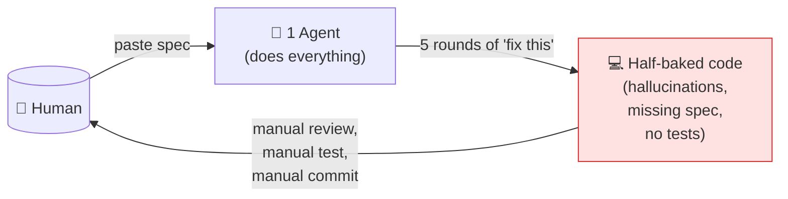
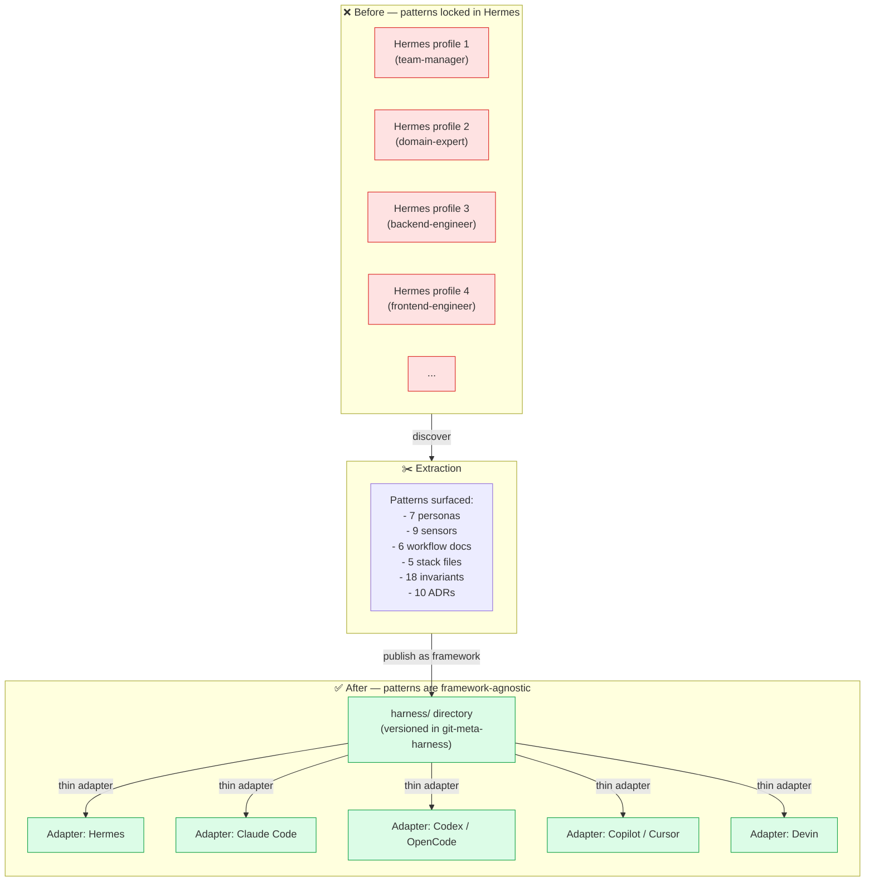

# Origin — How the meta-harness emerged from Hermes

> **TL;DR** — `git-meta-harness` was not designed top-down. It was
> **discovered** during an 8-week exploration of the Hermes Agent
> (a multi-profile agentic CLI), where the pattern "one model, one
> role" consistently outperformed "one model, everything". The
> meta-harness is the **distilled, tool-agnostic version** of the
> pattern that worked.

---

## 1. The starting point: a single-agent prompt loop

In late 2025, like most developers experimenting with agentic
tools, the work pattern was:

1. Open a chat with the agent.
2. Paste a spec, paste the codebase, ask for a feature.
3. Watch the agent hallucinate an architecture, write code that
   does not compile, miss the spec, and require 5 rounds of
   "fix this" to ship.
4. Manually review, manually test, manually commit, manually
   open a PR.

This is **single-agent prompt engineering**. It works for toy
tasks. It does not work for production software with multiple
services, multiple roles, multiple stakeholders, and a
non-negotiable CI gate.

The cost is invisible at first, then catastrophic: by the time
the codebase has 30 files, the agent has lost the thread. By 100
files, the same context is being re-explained 10 times per
session. By 300 files, the agent is confidently writing code
that contradicts code elsewhere in the repo.

---

## 2. The pivot: Hermes Agent and the profile model

The breakthrough came with **Hermes Agent**, an agentic CLI that
explicitly supports **multiple profiles**, each with its own
model, system prompt (SOUL), skills, and runtime state. Profiles
are isolated; they do not share context by accident; they do not
overwrite each other's config.

The intuition was simple: **if the problem is "one agent cannot
be expert in everything", then maybe the answer is "one agent per
role, each with the right model for that role"**.

So we created the first few profiles:

- `team-manager` — orchestrates the others; uses a reasoning
  model (MiniMax-M3).
- `domain-expert` — knows the business; uses the same reasoning
  model.
- `backend-engineer` — writes Go; uses a faster, more
  deterministic model.
- `frontend-engineer` — writes Nuxt; uses a faster model.
- `quality-assurance` — runs the sensors; uses a fast model.
- `devops-engineer` — handles CI/Docker/infra; uses a fast model.

The first test was a single small task. The result was
**immediately different** from the single-agent loop: the
`domain-expert` produced a refined acceptance criteria document;
the `solutions-architect` (a role added soon after) produced a
DoD; the `backend-engineer` produced code that compiled on the
first try; the `quality-assurance` found issues the
`backend-engineer` did not notice. **Each persona was operating
in its lane.**

---

## 3. The discovery: the "meta" pattern

After ~6 weeks of running this multi-profile loop, several
patterns became visible:

1. **The profiles were reproducible.** Anyone could create the
   same set of profiles by reading the SOUL files. The setup was
   not magic; it was a configuration that could be templated.

2. **The interactions between profiles were stable.** The
   `team-manager` always asked the `domain-expert` first. The
   `domain-expert` always handed off to the
   `solutions-architect`. The `solutions-architect` always
   handed off to the builders. The QA always came last. **This
   was not Hermes-specific; this was a workflow.**

3. **The briefings were the contract.** The `team-manager` posted
   a human-readable briefing on each issue before dispatching.
   The receiving persona read the briefing, not the entire
   history. The briefing was the unit of work. **This was not
   Hermes-specific; this was a project management pattern.**

4. **The sensors were the gate.** A `lint` sensor, a `test`
   sensor, a `vuln` sensor, a `contract` sensor, a `12-factor`
   sensor. Without these, the agents would happily ship code
   that does not compile, has known CVEs, or violates
   twelve-factor. **The sensors were non-negotiable, and they
   were not Hermes-specific either.**

5. **The stack had to be pinned.** The first time a different
   Go version was used in the Dockerfile vs the `go.mod`, a
   build failed for 30 minutes before being noticed. The
   solution was not "be more careful" but "pin everything, in
   one place, and validate it". The `versions.md` was born.

6. **The `domain-expert` had to be specialized.** A generic
   "domain expert" profile that covers all domains is
   shallow. A `domain-expert-mandai` that knows about Brazilian
   Pix, community group buying, multi-tenant by workspace, and
   multi-role per account is **useful**. **Domain expertise
   cannot be a skill; it must be a persona.**

At that point, the realization was clear: **we were not
configuring Hermes profiles; we were configuring a meta-system
that happened to be expressed in Hermes profiles**. The patterns
were the asset, not the runtime.

---

## 4. The extraction: from Hermes profiles to the meta-harness

The next step was to **separate the patterns from the runtime**.

The patterns became:

- `harness/personas/*.md` — the SOUL of each role, written in
  plain markdown, tool-agnostic.
- `harness/sensors/*.md` — the spec of each gate.
- `harness/workflow/*.md` — the lifecycle of an issue.
- `harness/stack/versions.md` — the pinada source of truth.
- `harness/templates/*` — the files that get generated.
- `harness/contrib/design-decisions.md` — the ADRs.

The runtime-specific configuration became a thin adapter:

- For Hermes Agent: a script that creates a profile from a
  persona's markdown + the user's `config.yaml` model default.
- For Claude Code: `.claude/agents/<name>.md` generated from the
  same persona + skill bundles.
- For Codex CLI / OpenCode: `AGENTS.md` at the project root.
- For Devin: same `AGENTS.md` with a `.devin/` config.
- For GitHub Copilot: `.github/agents/<name>.md` + a
  `copilot-instructions.md`.
- For Cursor: `.cursorrules` generated from `AGENTS.md`.

The **input** to all of these adapters is the same: the
`harness/` directory. The **output** is a tool-specific runtime
configuration that **honors the same spec**.

This is the "meta" in meta-harness: the unit being configured is
not the agent, it is the harness-factory. The factory produces
agent harnesses for any tool.

---

## 5. The validation: Mandaí v2

The first project to use the meta-harness end-to-end was
**Mandaí v2** (a B2B2C community group buying marketplace,
modeled on Meituan Select / Duoduo Maicai, targeting the BR/LATAM
market with Pix-first payments).

- **Repo:** https://github.com/brenonaraujo/mandai-v2
- **Stack:** Go 1.25 + Gin + GORM + PostgreSQL + Nuxt 4 + Pinia
- **i18n:** en, pt-BR, es
- **Outcome:** 4 issues, 5 commits, 1 PR, working
  `/healthz`/`/readyz`/`/metrics`, 12-factor conformant, 80.5%
  coverage, i18n parity 100%.

The pilot was **not clean**. The first PR reached the human
with 5/5 checks red because the CI workflow was misconfigured.
The meta-harness itself was missing the smoke test and the
check-stack-versions script, so the version drift between
Dockerfile, `go.mod`, and CI was not caught at the start. A
generic `domain-expert` profile was used in the first
iteration, producing shallow domain analysis.

Those bugs became **the smoke test** (12 checks that detect
them all in seconds), the **check-stack-versions.sh** (online
drift detection), and the **invariant** that `domain-expert` is
**always specialized**, never generic. The meta-harness v1.0.0
is what came out the other side.

---

## 6. The lesson: pattern > tool

The single most important lesson from this exploration is this:

> **The pattern is more durable than the tool.**

Hermes Agent is one tool. Claude Code is another. Codex CLI,
OpenCode, Devin, Cursor — they are all tools, with different
lifecycles, different pricing models, different APIs. Every one
of them will be replaced in 18 months.

```mermaid
flowchart LR
    subgraph TOOLS["🔧 Tools (cycled every ~18 months)"]
        T1["Hermes<br/>(2025-2026)"]
        T2["Claude Code<br/>(2025-2027)"]
        T3["Codex / OpenCode<br/>(2025-2027)"]
        T4["???<br/>(2027+)"]
    end

    subgraph PATTERN["🌱 Pattern (durable)"]
        P1["decompose by role"]
        P2["route by type"]
        P3["gate by sensor"]
        P4["document by ADR"]
        P5["validate by human"]
        P6["ship by PR"]
    end

    subgraph META["📦 The deliverable"]
        M["git-meta-harness<br/>(versioned pattern,<br/>framework-agnostic)"]
    end

    TOOLS -.->|"each tool<br/>hosts the pattern"| M
    M -->|"encodes"| PATTERN

    classDef durable fill:#dcfce7,stroke:#16a34a
    class PATTERN,META durable
    classDef ephemeral fill:#fef3c7,stroke:#f59e0b
    class TOOLS ephemeral
```

**Reading the diagram:** the tools are ephemeral (cycled every
~18 months); the pattern is durable. The meta-harness is the
package that delivers the pattern **independent of which tool
hosts it**.

But the pattern — "decompose the work by role, route by type,
gate by sensor, document by ADR, validate by human, ship by PR"
— is **independent of the tool**. The meta-harness captures the
pattern. The tool is the substrate that runs it.

That is why the meta-harness is published as a GitHub repository
with markdown specs, ADRs, and seed prompts — and **not** as a
Python package, a CLI binary, or a SaaS. The pattern is the
deliverable. The pattern is what survives the next tool cycle.
