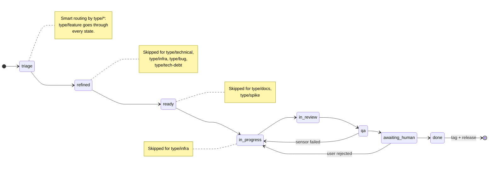
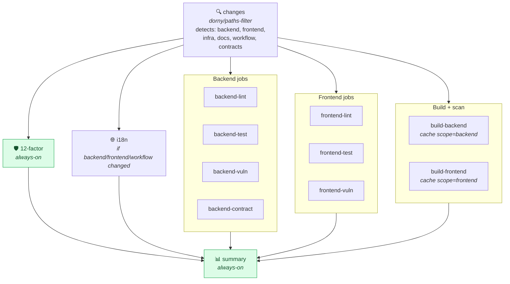

# Pipeline — How the meta-harness rides on GitHub

> **TL;DR** — The meta-harness does not introduce a new
> platform. It uses GitHub Issues, Pull Requests, Labels, GitHub
> Actions, Branch Protection, CODEOWNERS, and Releases as its
> native substrate. Every pattern in the meta-harness is a
> pattern that already exists in GitHub, applied with
> discipline. This is what makes it low-friction to adopt.

---

## 1. The five GitHub primitives the meta-harness relies on

| Primitive                  | Role in the meta-harness                          | Without it, the meta-harness... |
|----------------------------|--------------------------------------------------|---------------------------------|
| **Issues**                 | Work queue of the team; per-issue briefing lives here. | Cannot decompose the spec.       |
| **Pull Requests**          | Unit of delivery; 1 issue = 1 PR.                | No way to validate before merge. |
| **Labels** (`type/*`, `domain/*`) | Routing mechanism (smart routing).            | Routing becomes ad-hoc.          |
| **GitHub Actions**         | CI/CD substrate; modular workflow with path filters. | No automated gates.              |
| **Branch Protection Rules** | The "human validation" gate, enforced at GitHub.  | Humans can merge without review. |

Optional but recommended:

- **CODEOWNERS** — assigns each `harness/` path to an owner
  (the persona responsible).
- **Releases + Tags** — versioned, auditable output.
- **Discussions / Projects** — roadmap and sprint planning.

---

## 2. The issue lifecycle in the meta-harness

The full lifecycle is defined in `harness/workflow/00-issue-lifecycle.md`.
Summary:



| State            | Owner                                                   | What happens                                                              |
|------------------|---------------------------------------------------------|---------------------------------------------------------------------------|
| `triage`         | `team-manager`                                          | Detect type, domain, decompose into sub-issues, add labels.               |
| `refined`        | `domain-expert-<x>` (skipped for `type/technical|infra|bug|tech-debt`) | Refine ACs from the spec.                            |
| `ready`          | `solutions-architect` (skipped for `type/docs|spike`)   | Produce DoD, identify open questions, propose ADRs.                      |
| `in-progress`    | `backend-engineer` / `frontend-engineer` / `devops-engineer` (skipped for `type/infra`) | Code, tests, local pre-flight. Branch created by team-manager. |
| `in-review`      | `team-manager`                                          | Open PR, post the briefing as a comment.                                  |
| `qa`             | `quality-assurance`                                     | Run all 9 sensors. Approve or return.                                     |
| `awaiting_human` | `team-manager`                                          | Block on the human. Branch protection enforces.                           |
| `done`           | `team-manager`                                          | Merge, tag, release, close issue.                                         |

The `team-manager` is the **only** persona that moves an issue
between states. Sub-personas do not self-advance; they
**report back** via a comment on the issue.

---

## 3. The PR convention

Every PR in a meta-harness project follows this structure:

1. **Title**: `<type>(<scope>): <subject>`
   - e.g., `feat(backend): add /users endpoint with phone + password_hash`
2. **Body** (from the `harness/templates/pr-description.md`):
   ```markdown
   ## What & Why
   <!-- 1-3 sentences referencing the issue. -->

   Closes #N

   ## How to test locally
   <!-- Commands a reviewer can run. -->

   ## Definition of done
   - [ ] acceptance criteria from #N met
   - [ ] tests added/changed
   - [ ] 12-factor audit passed
   - [ ] i18n parity (en/pt-BR/es) maintained
   - [ ] no hardcoded strings
   - [ ] no coverage regression
   ```
3. **Linked issue** is closed automatically when merged.
4. **Required checks** (set in Branch Protection):
   - Smoke test
   - Stack version check
   - Lint
   - Test + coverage
   - Vulnerability scan
   - OpenAPI contract
   - 12-Factor audit
   - i18n audit
5. **CODEOWNERS** automatically assigns reviewers based on
   the changed files.

---

## 4. Labels: the routing mechanism

The meta-harness defines two label namespaces.

### `type/*` — what kind of work

| Label             | Routed personas (smart routing)                                        |
|-------------------|-------------------------------------------------------------------------|
| `type/feature`    | `domain-expert` → `solutions-architect` → builder → `qa`               |
| `type/technical`  | `solutions-architect` → builder → `qa` (skip `domain-expert`)          |
| `type/infra`      | `solutions-architect` → `devops-engineer` (skip `domain-expert`, builder) |
| `type/bug`        | `solutions-architect` → builder → `qa` (skip `domain-expert`)          |
| `type/tech-debt`  | builder → `qa` (skip `domain-expert`)                                  |
| `type/docs`       | `team-manager` only (editorial review)                                 |
| `type/spike`      | `solutions-architect` only (output = ADR)                              |

### `domain/*` — which domain-expert

| Label             | Routed persona                          |
|-------------------|------------------------------------------|
| `domain/banking`  | `domain-expert-banking`                  |
| `domain/retail`   | `domain-expert-retail`                   |
| `domain/mandai`   | `domain-expert-mandai`                   |
| `domain/<x>`      | `domain-expert-<x>`                      |

The `team-manager` reads both namespaces and dispatches. A
generic `domain-expert` is **a hard invariant violation** (no
such profile is created).

---

## 5. The CI workflow

The `harness/templates/.github-workflows-ci.yml` is a single
file with 12+ jobs orchestrated by a `changes` job at the top
that uses `dorny/paths-filter` to detect which components
changed.



Speed comparison (from `harness/contrib/design-decisions.md`
ADR-0011):

| Scenario                              | Without path filter | With path filter |
|---------------------------------------|---------------------|-------------------|
| PR only changes `web/i18n/pt-BR.json` | ~8 min              | ~30s              |
| PR only changes `backend/internal/...`| ~8 min              | ~3 min            |
| PR only changes `docs/SPEC.md`        | ~8 min              | ~30s              |
| 5 commits pushed to same PR           | 5 × 8 min = 40 min  | 1 × 8 min (cancel-in-progress) |

The path filter is **not optional**. It is the difference between
a CI that scales and a CI that costs more as the team grows.

---

## 6. The `gh` CLI trick: how the meta-harness saves tokens

One of the most impactful design choices in the meta-harness is
to use the **`gh` CLI** (GitHub's official command-line tool)
**instead of MCPs (Model Context Protocol servers) or heavy
SDKs** for talking to GitHub. This is what keeps the loop
cheap, fast, and reliable.

### What we mean

The `team-manager` persona (and all the others, when they need
to interact with GitHub) uses commands like:

```bash
gh issue list --label "type/feature" --state open --json number,title
gh issue create --title "..." --body "..." --label "type/feature,backend"
gh issue edit 42 --add-label "domain/mandai" --remove-label "triage"
gh pr create --title "..." --body "..." --base main --head feature/1-bootstrap
gh pr checks 5 --json name,state,conclusion
gh release create v1.3.0 --title "..." --notes-file /tmp/notes.md --target main
gh api repos/:owner/:repo/commits --jq '.[].sha'
```

Each call returns **exactly the JSON the persona needs**, ready
to be piped into `jq`, `awk`, or a small parsing function. No
schema, no server to run, no state to maintain.

### Why this is dramatically better than MCPs for our use case

| Aspect                        | `gh` CLI                                          | MCP server (e.g., `@modelcontextprotocol/server-github`)        |
|-------------------------------|---------------------------------------------------|------------------------------------------------------------------|
| **Token cost per call**       | Small (just the field you ask for).                | Large (server scaffolds the full GraphQL/REST context).          |
| **Round-trips**               | 1 call = 1 question, 1 answer.                    | Often 1 call = N sub-questions to assemble the answer.          |
| **Stateless**                 | Yes — pure CLI.                                   | Mostly, but the server holds connection pools, caches, etc.      |
| **Setup**                     | `brew install gh` (or already installed).         | Install + configure + run a long-lived server.                   |
| **Failure modes**             | CLI exit code, stderr. Trivial to debug.          | Server crashes, timeouts, schema mismatches, version drift.       |
| **Composability**             | Pipes into `jq`, `awk`, `grep`, `python3`, etc.   | Locked into the MCP's tool schema.                               |
| **Battle-tested**             | Official GitHub CLI, used by millions.             | Newer ecosystem; quality varies per server.                      |
| **Auth**                      | `gh auth login` (one-time).                       | OAuth dance + token management.                                 |

For the meta-harness use case (a team-manager posting a
briefing, opening an issue, adding a label, checking CI status),
**`gh` does exactly what we need with 5-10x less token overhead
per interaction**. A typical MCP-based equivalent would have
to:

1. Discover the available tools.
2. Match the user's intent to a tool.
3. Call the tool with the right parameters.
4. Parse the tool's structured response.
5. Possibly make a follow-up call (because the first didn't
   return enough).

With `gh`, steps 1-3 collapse to a single CLI invocation
already written by the persona. The agent reads the output,
takes the next action, and moves on.

### The pattern in the meta-harness

Every persona that interacts with GitHub uses `gh` in its
briefing. Examples from the actual personas (see
`harness/personas/*.md`):

- **`team-manager`**: `gh issue list`, `gh issue create`,
  `gh issue edit`, `gh pr create`, `gh pr merge`,
  `gh release create`, `gh label create`.
- **`quality-assurance`**: `gh pr checks`, `gh pr view`,
  `gh run download` (for logs), `gh api` (for sensor metadata).
- **`devops-engineer`**: `gh workflow run`, `gh secret set`,
  `gh release upload`.

There is **no MCP in the meta-harness**. This is a deliberate
choice. The `gh` CLI is a **better fit** for an agentic loop
than an MCP server, because the agentic loop optimizes for
**one question, one answer, one decision at a time** — exactly
what the CLI gives you.

### When MCP would make sense

MCPs shine when the agent needs to:

- Maintain state across many turns (e.g., a long-running
  investigation that pulls and caches data).
- Use specialized tools that don't have a CLI equivalent
  (e.g., a custom internal API).
- Coordinate multiple agents on shared resources.

The meta-harness does none of these. Each persona is
short-lived (one issue), each interaction is one CLI call,
and the shared state is GitHub itself (issues, PRs, comments).
**`gh` is the right tool.**

---

## 7. Why GitHub specifically (and not GitLab, Bitbucket, etc.)

The meta-harness is **tool-portable at the agent level**
(Hermes, Claude Code, Codex, etc. all work) but the pipeline is
currently **GitHub-specific** for the following reasons:

1. **Issues + PRs + Actions + Releases is the most-used
   combination** in open source and at work.
2. **CODEOWNERS and branch protection** are first-class and
   well-documented.
3. **GitHub Actions** has the largest ecosystem of reusable
   actions (including `dorny/paths-filter` and
   `aquasecurity/trivy-action`).
4. **GitHub Releases** is the standard way to publish
   versioned artifacts.

Porting to GitLab or Bitbucket would require replacing the
CI template and the issue template, but the **personas,
sensors, workflow, stack, and templates** would carry over
unchanged. The harness-of-harnesses is independent of the
hosting platform.

A future ADR-0014 (or similar) could formalize a GitLab
adapter if there is demand.

---

## 8. The "low-friction" promise, summarized

When a new project adopts the meta-harness, here is the entire
friction budget:

| Step                                           | Time    | Who        |
|------------------------------------------------|---------|------------|
| `git clone` the meta-harness                  | 5s      | human      |
| `cp -R harness ./harness` in the new project   | 5s      | human      |
| `cp templates/.github-workflows-ci.yml`         | 5s      | human      |
| `cp templates/.golangci.yml`                   | 5s      | human      |
| `cp templates/.env.example`                    | 5s      | human      |
| Paste the spec into the agentic CLI             | 60s     | human      |
| Wait for the team-manager to materialize       | 5-30 min| agent      |
| Review the first PR                            | 15 min  | human      |
| Merge when the sensors are green               | 5s      | human      |
| **Total to a working PR:**                     | **~1 hour** | —    |

Without the meta-harness, the same project would be 1-2 days
of stack decision, Dockerfile writing, CI configuration,
issue template creation, persona definition, and ADR setup —
**before** any business code is written.
