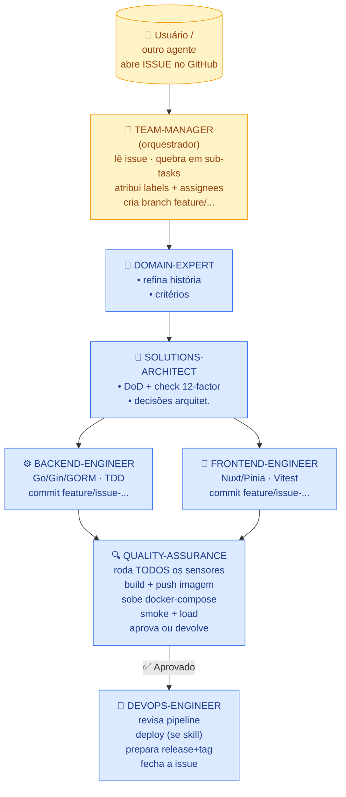

# Meta-Harness — Bootstrap Spec

> **Arquivo canônico** do meta-harness. Este é o **contrato-mestre** que o
> `team-manager` lê antes de qualquer ação. Tudo que um agente precisa
> saber para entregar um projeto **greenfield → release** mora aqui ou é
> referenciado daqui.
>
> **Versão:** 1.5.0
> **Status:** stable
> **Owners:** time de plataforma
> **Licença:** MIT
> **Validation and test case:** ✅ [brenonaraujo/mandai-v2](https://github.com/brenonaraujo/mandai-v2)

---

## 1. Visão

O meta-harness entrega um framework **declarativo, reprodutível e
multi-tool** que:

- **Orquestra** uma equipe de personas (agentes) especializados em um
  fluxo ponta-a-ponta de issues → branch → PR → snapshot → merge →
  release.
- **Impõe** um padrão de stack, código, testes e observability comum a
  todos os projetos gerados a partir deste seed.
- **Automatiza** sensores (lint, testes, SAST, image scan, smoke, load)
  em CI e localmente.
- **Gera** os artefatos nativos do tool (Claude Code, Copilot, Codex,
  Hermes, …) a partir de uma única fonte (`harness/*`).

O meta-harness é **agnóstico de domínio** (fintech, retail, SaaS,
interno, …). Ele impõe o **como**; o **o quê** vem da especificação
funcional do projeto (ver §3).

---

## 2. Princípios fundacionais

> Inegociáveis. Mudanças aqui exigem ADR em `contrib/design-decisions.md`.

1. **KISS, DRY, código limpo** — sem esperteza, sem duplicação, sem
   comentários redundantes.
2. **Twelve-factor** — ver §7. Cada microsserviço deve aderir.
3. **Funções ≤ 25 linhas, arquivos ≤ 150 linhas** — enforcement via
   `funlen` no golangci-lint e `max-lines` no ESLint.
4. **TDD** — teste de borda primeiro, table-driven, `testify`. Sem
   testes, sem merge.
5. **Spec-first** — OpenAPI define o contrato de API; SQL schema define
   o modelo de dados; schema de mensagem (Avro/JSON-Schema) define
   contratos assíncronos. **Nenhum builder implementa sem o contrato
   aprovado pelo `solutions-architect`.**
6. **1 issue → 1 branch → 1 PR** — múltiplos builders podem commitar
   na mesma branch, mas **só existe um PR por feature**.
7. **Snapshot local testável** — o PR **deve** trazer um comando
   (docker-compose) e a URL local para o usuário validar antes do merge.
8. **Observability não é opcional** — Prometheus metrics + slog JSON em
   todo microsserviço. Endpoint `/metrics` exposto; logs em stdout,
   formato JSON, com `request_id`, `trace_id`, `span_id` quando aplicável.
9. **Imagens leves** — multi-stage, base `gcr.io/distroless/static` ou
   `alpine` mínimo, executa como non-root, com healthcheck e graceful
   shutdown.
10. **Source of truth = GitHub Issues + `harness/*`** — nada é dito em
    chat que não vire issue ou commit. As personas documentam tudo no
    issue correspondente.
11. **i18n obrigatório** — toda string externalizada (mensagens de
    erro da API, mensagens do usuário no frontend, e-mails, SMS,
    notificações push) **deve** passar por um sistema de
    internacionalização. **Idiomas padrão:** `en` (English),
    `pt-BR` (Português brasileiro), `es` (Español). A escolha do
    idioma é feita via header `Accept-Language` (API) e
    seletor de locale (frontend). **Nenhuma** string visível
    ao usuário pode ser hardcoded em código. Ver sensor
    [`sensors/08-i18n-audit.md`](./sensors/08-i18n-audit.md).
12. **Smoke test obrigatório** — o `team-manager` DEVE rodar
    `harness/scripts/smoke-test.sh` antes de processar qualquer
    issue. Falha **bloqueia** o fluxo. Esse check captura 3
    bugs sutis que passaram no piloto Mandaí v2 (ver
    [`smoke-test.md`](./smoke-test.md) e ADR-0007): smart
    routing não aplicado, domain-expert genérico, e versão
    antiga do meta-harness.
13. **Versões pinadas** — todo componente da stack tem versão
    fixa (não `latest`). Ver [`stack/versions.md`](./stack/versions.md)
    (canônica) e ADR-0009. **Quebrar o pinning só via ADR.**

---

## 3. Fluxo geral ponta-a-ponta



**Detalhamento** em [`workflow/`](./workflow/).

---

## 4. Personas (agentes)

> Cada persona tem um arquivo dedicado em
> [`personas/`](./personas/). Resumo:

| Persona              | Responsabilidade                                                                                 | Saída típica                              |
|----------------------|--------------------------------------------------------------------------------------------------|-------------------------------------------|
| **team-manager**     | Orquestra. Lê issues, quebra em tasks, atribui, acompanha até o merge.                           | Sub-issues, labels, comments de status.   |
| **domain-expert-`<domínio>`** | **Especialista de um domínio específico** (ex.: `domain-expert-banking`, `domain-expert-retail`, `domain-expert-mandai`). Refina histórias, escreve critérios de aceite, conhece regras de negócio e compliance do domínio. | Histórias refinadas + critérios de aceite. |
| **solutions-architect** | Avalia tecnicamente, define DoD, valida 12-factor, propõe padrões.                              | DoD + checklist 12-factor + decisões.     |
| **backend-engineer** | Implementa backend Go/Gin/GORM com TDD, OpenAPI, observability, Dockerfile.                       | Código + testes + Dockerfile + migration. |
| **frontend-engineer**| Implementa frontend Nuxt/Pinia com TDD, sem browser manual.                                       | Código + testes + Dockerfile + storybook. |
| **quality-assurance**| Roda sensores, sobe ambiente, executa smoke/load (Gatling), aprova ou devolve.                     | Relatório de QA + bugs ou aprovação.      |
| **devops-engineer**  | Mantém pipelines, scans de imagem, secrets, deploy (quando skill existe), release.                | Workflows + tag + release artifacts.      |

> **Sobre `domain-expert-<domínio>`:** o domain-expert é **sempre**
> especializado. Um projeto pode ter 1+ domain-experts
> simultâneos (ex.: um e-commerce com `domain-expert-payments` +
> `domain-expert-logistics`). O **team-manager** detecta o domínio
> da issue (via label `domain/<nome>` ou pergunta ao autor) e
> atribui ao especialista correto. Ver
> [`personas/domain-expert.template.md`](./personas/domain-expert.template.md)
> e [`personas/examples/`](./personas/examples/).

> **Regra de ouro:** o `team-manager` é a única persona que **atribui**
> e **fecha** issues. Builders **não** fecham issues sozinhos; eles
> comentam o status e o `team-manager` fecha quando todos os sensores
> passam.

---

## 5. Stack & código

> Padrões detalhados em [`stack/`](./stack/).

### 5.1 Backend (microsserviço)

| Camada              | Tecnologia                                                                                  |
|---------------------|----------------------------------------------------------------------------------------------|
| Linguagem           | **Go** 1.22+                                                                                 |
| HTTP framework      | **Gin** (`github.com/gin-gonic/gin`)                                                         |
| ORM                 | **GORM** v2 (`gorm.io/gorm`)                                                                 |
| Banco de dados      | **PostgreSQL** 16+                                                                          |
| API contract        | **OpenAPI 3.1** (spec-first via `oapi-codegen` ou `ogen`)                                  |
| Validação           | `go-playground/validator/v10` + tipos gerados do OpenAPI                                     |
| Migrations          | `golang-migrate/migrate` (CLI + library) ou `go-gorm/gorm` AutoMigrate (com cuidado)         |
| Logging             | **`log/slog`** com `slog.NewJSONHandler(os.Stdout, …)` (nativo Go 1.21+)                    |
| Metrics             | **`prometheus/client_golang`** + `promhttp`                                                |
| Tracing (opcional)  | OpenTelemetry (`otelgin`, `otelslog` bridge)                                                |
| Config              | `envconfig` ou `kelseyhightower/envconfig` (env vars obrigatórias)                           |
| **i18n**            | **`nicksnyder/go-i18n/v2`** com bundles em `internal/i18n/locales/{en,pt-BR,es}.json`; seleção via header `Accept-Language` |
| Testes              | `testing` + `stretchr/testify` + table-driven; mocks com `uber-go/mock` ou `mockery`         |
| Lint                | `golangci-lint` v2 com config base em [`templates/.golangci.yml`](./templates/)             |
| SAST                | `gosec` (dentro do golangci-lint)                                                            |
| SCA                 | `govulncheck`                                                                                |

### 5.2 Frontend

| Camada              | Tecnologia                                                                                  |
|---------------------|----------------------------------------------------------------------------------------------|
| Framework           | **Nuxt 3 / Nuxt 4** com **Nuxt UI v3** (`@nuxt/ui`)                                          |
| **i18n**            | **`@nuxtjs/i18n`** v8+ com bundles em `i18n/locales/{en,pt-BR,es}.json`; detecção automática de browser + seletor manual |
| State               | **Pinia** (`@pinia/nuxt` + Setup Stores)                                                     |
| Linguagem           | TypeScript                                                                                   |
| Testes              | **Vitest** + `@vue/test-utils` + `@nuxt/test-utils`                                          |
| Lint/Format         | ESLint (`@nuxt/eslint`) + Prettier                                                           |
| Storybook (opcional)| Histoire ou Storybook 8                                                                      |
| E2E                 | Playwright (criado pelo QA, não pelo frontend-engineer)                                     |

### 5.3 Estrutura de pastas (backend — Standard Go Project Layout)

```
my-service/
├── cmd/
│   └── server/
│       └── main.go              # apenas wiring; < 50 linhas
├── internal/
│   ├── app/                     # bootstrap (config, logger, db, server)
│   │   ├── config.go
│   │   ├── logger.go
│   │   ├── db.go
│   │   └── server.go
│   ├── api/                     # gerado do OpenAPI (oapi-codegen)
│   │   └── openapi.gen.go
│   ├── handler/                 # controllers finos (1 endpoint = 1 func)
│   ├── service/                 # regras de negócio (puro, sem framework)
│   ├── repository/              # interfaces + implementações GORM
│   ├── domain/                  # entidades e erros de domínio
│   └── platform/                # adapters: postgres, httpclient, slack, etc.
├── pkg/                         # libs exportáveis (vazio por padrão; evitar)
├── api/
│   └── openapi.yaml             # CONTRATO — fonte da verdade
├── migrations/                  # arquivos .sql versionados (golang-migrate)
├── deploy/
│   ├── Dockerfile               # multi-stage, distroless
│   └── docker-compose.yml       # service + postgres + observability
├── .github/
│   └── workflows/               # CI + release
├── configs/                     # YAML defaults (opcional; preferir env)
├── test/                        # integration + e2e
├── scripts/                     # scripts auxiliares (make targets)
├── go.mod
├── go.sum
├── .golangci.yml
└── README.md
```

### 5.4 Estrutura de pastas (frontend — Nuxt 4)

```
my-app/
├── app/
│   ├── app.vue
│   ├── error.vue
│   ├── pages/                   # roteamento automático
│   ├── layouts/
│   ├── components/              # auto-imported
│   │   ├── common/              # 100% reutilizáveis
│   │   ├── feature/             # 1 feature de negócio
│   │   └── ui/                  # wrappers sobre Nuxt UI
│   ├── composables/             # useFoo()
│   ├── stores/                  # Pinia setup stores (auto-imported)
│   ├── middleware/
│   ├── plugins/
│   ├── assets/
│   └── utils/                   # pure functions
├── server/                      # rotas server (Nitro)
├── shared/                      # tipos compartilhados client/server
├── public/
├── tests/
│   ├── unit/
│   └── e2e/
├── nuxt.config.ts
├── package.json
├── tsconfig.json
└── .env.example
```

### 5.5 Limites rígidos de código

| Limite                  | Valor   | Enforcement                                              |
|-------------------------|---------|----------------------------------------------------------|
| Linhas por função       | **≤ 25**| `funlen { lines: 25, statements: 20 }` no golangci-lint. |
| Linhas por arquivo `.go`| **≤ 150**| `lll` (line length) + convenção de revisão; script `wc -l` no CI. |
| Complexidade ciclomática| **≤ 15** | `gocyclo` no golangci-lint.                              |
| Comentários             | **0 redundantes** | só comentários de `// TODO(name): ...` ou godoc em exports. |
| Cobertura mínima (unit) | **≥ 80%** das branches lógicas (não do LOC). | `go test -coverprofile` + diff coverage no PR. |

---

## 6. Workflow de issues, branches, PRs e releases

> Detalhes em [`workflow/`](./workflow/).

### 6.1 Ciclo de uma issue

```
1.  Criada (label: `triage`)
2.  domain-expert: refina (label: `refined`)
3.  solutions-architect: define DoD + checklist 12-factor (label: `ready`)
4.  team-manager: cria branch `feature/<issue>-<slug>` (label: `in-progress`)
5.  builders (backend/frontend): implementam + testam (label: `in-review`)
6.  quality-assurance: roda sensores + snapshot local (label: `qa`)
7.  team-manager: pede validação ao usuário (snapshot URL no PR)
8.  usuário valida
9.  team-manager: merge + tag + release (label: `done`, fecha issue)
```

### 6.2 Branching

- **Branches de feature:** `feature/<issue-id>-<slug-em-kebab-case>`
  Exemplo: `feature/42-criar-endpoint-de-login`.
- **Branches de bugfix:** `fix/<issue-id>-<slug>`.
- **Branches de release:** `release/vX.Y.Z` (criada pelo devops-engineer).
- **Main é sagrada:** merge sempre via PR + checks verdes.

### 6.3 Pull Request

- **1 PR por issue principal.** Vários builders podem fazer commits na
  **mesma** branch.
- **Título:** `(#<issue>) <título da issue>`.
- **Corpo** (template em [`templates/pr-description.md`](./templates/)):
  - Summary (1 parágrafo)
  - O que foi feito (checklist)
  - Sensores (todos verdes)
  - **Como testar localmente** ← **obrigatório** com `docker compose up`
  - Screenshots/curls de exemplo
  - Riscos & rollback

### 6.4 Snapshot local

- O PR inclui (ou o usuário já tem) um `deploy/docker-compose.yml` que
  sobe **o serviço + dependências** (postgres, redis, …).
- Comando padrão: `docker compose -f deploy/docker-compose.yml up -d`.
- O comentário do PR diz: `Acesse http://localhost:8080/healthz para validar`.
- A issue **só fecha depois que o usuário comenta "validado" no PR**.

### 6.5 Release

- Merge na main dispara workflow de **release** (ver
  [`templates/.github-workflows-release.yml`](./templates/)).
- Bump de versão via **Conventional Commits** + `release-please` ou
  `semantic-release`.
- Tag `vX.Y.Z` é criada e assinada.
- Imagens Docker são publicadas em GHCR com tags `latest` e `sha-<commit>`.

---

## 7. Twelve-factor (checklist obrigatório por microsserviço)

> Cada microsserviço é auditado pelo sensor
> [`sensors/07-twelve-factor-audit.md`](./sensors/07-twelve-factor-audit.md).

| #    | Fator               | Como o meta-harness garante                                              |
|------|---------------------|--------------------------------------------------------------------------|
| I    | Codebase            | 1 repo = 1 microsserviço; sem monorepo sem motivo.                       |
| II   | Dependencies        | `go.mod` + `go.sum` (backend); `package.json` + `pnpm-lock.yaml` (frontend). |
| III  | Config              | **Zero** config em código. Tudo via env (`envconfig`).                   |
| IV   | Backing services    | Postgres/Redis/Rabbit referenciados por URL via env (`DATABASE_URL`).   |
| V    | Build, release, run | CI separa os 3 estágios; release é imutável (imagem taggeada).           |
| VI   | Processes           | Stateless; estado só em DB/Redis. Sem sessões locais.                    |
| VII  | Port binding        | Serviço exporta sua porta via `PORT` env (`8080` default).              |
| VIII | Concurrency         | Escala horizontal (K8s replicas, docker compose scale).                  |
| IX   | Disposability       | `SIGTERM` → graceful shutdown ≤ 30s. Startup ≤ 5s.                      |
| X    | Dev/prod parity     | Mesma imagem, mesmas migrations, mesma config schema.                    |
| XI   | Logs                | stdout JSON via slog, **nunca** arquivo. Sem `log.Fatal` em libs.        |
| XII  | Admin processes     | `cmd/migrate/`, `cmd/seed/`, `cmd/cleanup/` como binários one-off.       |

---

## 8. Observability (padrão por microsserviço)

> Detalhes em [`stack/observability.md`](./stack/observability.md).

- **Métricas:** `prometheus/client_golang`, expostas em `:8080/metrics`
  (porta configurável via `METRICS_PORT`).
- **Métricas obrigatórias:**
  - `http_requests_total{method,path,status}`
  - `http_request_duration_seconds{method,path}` (histogram)
  - `db_queries_total{operation,table,status}`
  - `db_query_duration_seconds{operation,table}` (histogram)
  - `app_info{version,commit,go_version}` (gauge, sempre 1)
- **Logs:** `slog.NewJSONHandler(os.Stdout, …)`, nível configurável via
  `LOG_LEVEL`. Campos obrigatórios: `ts`, `level`, `msg`, `service`,
  `request_id`, `trace_id?`, `span_id?`.
- **Health:** `GET /healthz` (liveness), `GET /readyz` (readiness).
- **Tracing (opcional mas recomendado):** OpenTelemetry com OTLP HTTP
  exporter, `otelgin` middleware, `otelslog` bridge.

---

## 9. Sensores (checks automatizados)

> Detalhes em [`sensors/`](./sensors/).

| #  | Sensor                  | Quando roda                         | Falha → ação                                      |
|----|-------------------------|-------------------------------------|---------------------------------------------------|
| 00 | Static analysis         | `pre-commit` + CI                   | bloqueia merge se erro.                           |
| 01 | Vulnerability scan      | CI (push/PR) + semanal              | bloqueia merge se HIGH/CRITICAL sem waiver.       |
| 02 | Unit tests              | `pre-commit` + CI                   | bloqueia merge se coverage < 80% ou falha.        |
| 03 | Contract tests          | CI (após unit)                      | bloqueia merge se openapi-diff quebrar.           |
| 04 | Image scan              | CI (após build)                     | bloqueia deploy se CRITICAL sem waiver.           |
| 05 | Smoke tests             | QA agent (manual/auto)              | devolve para builder com log.                     |
| 06 | Load tests              | QA agent (nightly/manual)           | reporta; não bloqueia merge, mas bloqueia release.|
| 07 | 12-factor audit         | devops-engineer (no DoD)            | bloqueia merge se algum fator não satisfeito.     |
| 08 | i18n audit              | CI (em PRs que tocam i18n)          | bloqueia merge se paridade < 100%.                |
| 09 | verify-after-build      | team-manager (entre in-progress → in-review) | devolve ao builder se claim de "PRONTO" não bate com a realidade (auto-relato mentiroso). Ver [`sensors/09-verify-after-build.md`](./sensors/09-verify-after-build.md) + ADR-0014. |

## 9b. Smart routing por `type/*` (team-manager)

O `team-manager` **roteia o fluxo por label `type/<x>`**, pulando
personas quando elas agregam zero valor. Ver
[`personas/team-manager.md`](./personas/team-manager.md) §4 e
[`personas/interactions.md`](./personas/interactions.md) para a matriz
completa.

| Label              | Domain-expert | Solutions-architect | Builder     | QA            | DevOps         |
|--------------------|:-------------:|:-------------------:|:-----------:|:-------------:|:--------------:|
| `type/feature`     | ✅             | ✅                   | ✅           | ✅             | (se deploy)     |
| `type/technical`   | ❌             | ✅                   | ✅           | ✅             | (se deploy)     |
| `type/infra`       | ❌             | ✅                   | ❌           | (revisão)     | ✅              |
| `type/bug`         | ❌             | ✅                   | ✅           | ✅             | (se deploy)     |
| `type/tech-debt`   | ❌             | (revisão)            | ✅           | ✅             | (se deploy)     |
| `type/docs`        | ❌             | ❌                   | ❌           | (revisão)     | ❌              |
| `type/spike`       | ❌             | ✅ (entrega = ADR)   | ❌           | ❌             | ❌              |

---

## 10. Tools suportados (multi-tool)

> O meta-harness é uma **fonte única declarativa** que o `team-manager`
> materializa nos layouts nativos de cada tool.

| Tool                | Layout                                                                | Onde ficam personas/skills               |
|---------------------|------------------------------------------------------------------------|----------------------------------------|
| **Claude Code**     | `CLAUDE.md` + `.claude/agents/*.md` + `.claude/skills/*.md` + `.claude/commands/*.md` | `.claude/`         |
| **GitHub Copilot**  | `.github/copilot-instructions.md` + `.github/agents/*.md`             | `.github/`         |
| **Codex CLI**       | `AGENTS.md` + `.codex/agents/*.md`                                    | `.codex/`          |
| **OpenCode**        | `AGENTS.md` + `.opencode/agents/*.md` + `.opencode/skills/*.md`      | `.opencode/`       |
| **Devin CLI**       | `AGENTS.md` + `.devin/`                                               | `.devin/`          |
| **Hermes Agent**    | `~/.hermes/skills/<name>/SKILL.md` + profile + `SOUL.md`              | `~/.hermes/`       |
| **Cursor**          | `.cursorrules` + `.cursor/rules/*.md`                                 | `.cursor/`         |

O contrato multi-tool está em [`AGENTS.md`](./AGENTS.md).

---

## 11. Como instanciar este meta-harness em um novo projeto

> O prompt pronto está em [`seed/meta-harness-seed.md`](./seed/meta-harness-seed.md).

TL;DR:

1. **Crie o repo** (ou peça ao `team-manager` para sugerir nome).
2. **Copie `harness/`** para a raiz.
3. **Adapte** `stack/*` e `templates/*` ao domínio do projeto (sem
   quebrar os princípios).
4. **Abra a primeira issue** descrevendo a feature.
5. **Rode o seed prompt** no tool escolhido. O `team-manager` assume.

---

## 12. Glossário

- **Persona** — perfil de agente (system prompt + skills + escopo).
- **Builder** — qualquer persona de execução (backend, frontend, qa,
  devops). Não inclui o `team-manager` (que é orquestrador).
- **Sensor** — check automatizado que valida uma propriedade.
- **Snapshot** — ambiente docker-compose local, subido pelo QA, para
  validação humana antes do merge.
- **DOD** (Definition of Done) — checklist técnico produzido pelo
  `solutions-architect` que o `backend`/`frontend` deve cumprir para
  marcar a issue como pronta.
- **DOR** (Definition of Ready) — checklist do `domain-expert` para a
  issue ser considerada "pronta para implementação".
- **Waiver** — exceção aprovada pelo `team-manager` para um sensor
  falhar (ex.: CVSS < 4 com prazo de correção).

---

## 13. Versionamento deste meta-harness

- **Semver** (`MAJOR.MINOR.PATCH`).
- Mudanças nos princípios (§2) → `MAJOR`.
- Novas personas, novos sensors, novos tools → `MINOR`.
- Fix de templates, typos, links → `PATCH`.
- Toda mudança relevante → ADR em `contrib/design-decisions.md`.
- Versão atual: ver arquivo `VERSION` na raiz do meta-harness.

## 14. Smoke test (obrigatório)

> O `team-manager` **DEVE** rodar
> `harness/scripts/smoke-test.sh` antes de processar qualquer issue.
> Se o smoke test falhar, **NÃO processe** — corrija primeiro.
>
> O smoke test valida 12 itens críticos:
> versão, arquivos obrigatórios, smart routing, interações matrix,
> domain-experts especializados, ausência de genéricos, ADR-0006
> aplicado, ≥15 invariantes, labels `type/*`, profiles Hermes
> corretos.
>
> Detalhes em [`smoke-test.md`](./smoke-test.md) e ADR-0007 (lessons
> learned do piloto Mandaí v2 — jul/2026).

---

> Última revisão: 2026-07-18
> Próxima revisão sugerida: após o primeiro projeto piloto (30 dias).
