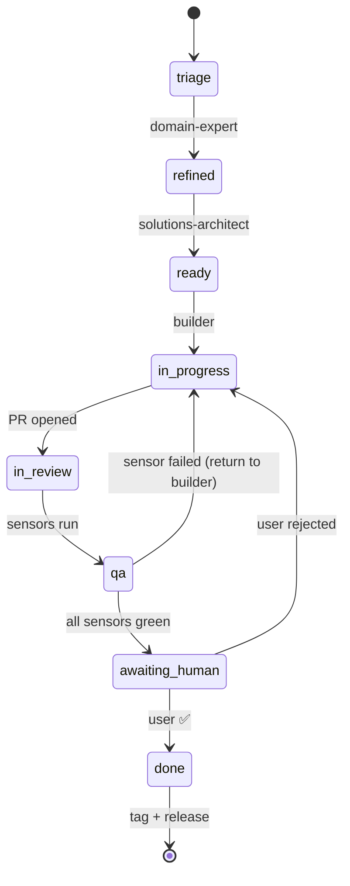
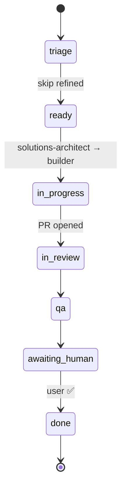
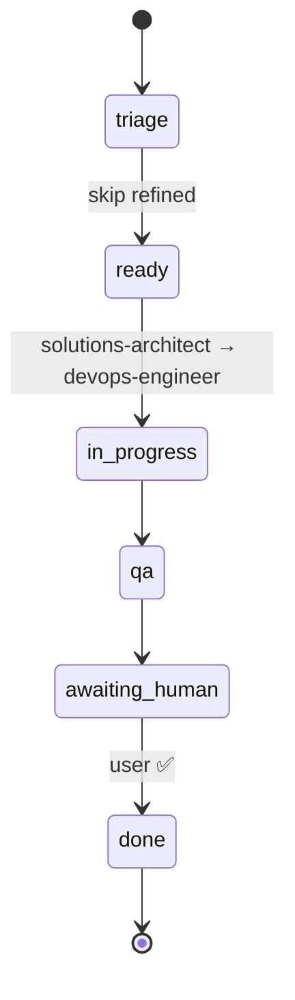
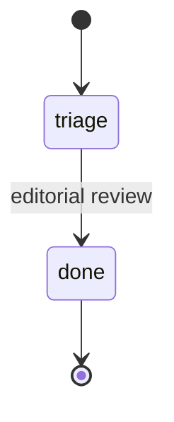
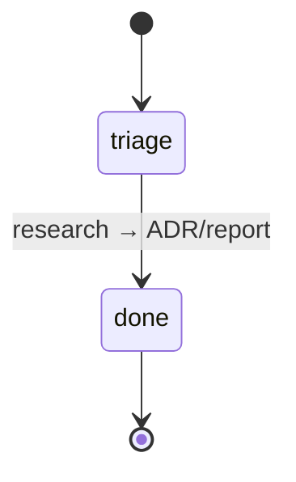

# Workflow 00 — Issue Lifecycle

> O ciclo de vida de uma issue, do `triage` ao `done`. **Este é o
> fluxo oficial** que o `team-manager` enforce.
>
> **Importante:** o caminho **não é único** — depende do **tipo**
> da issue (ver §0 abaixo). Issues técnicas/infra **pulam**
> `domain-expert`. O `team-manager` decide quem entra.

---

## 0. Smart routing — qual caminho seguir?

> Decidido na triagem pelo `team-manager` (ver
> [`team-manager.md` §4](../personas/team-manager.md)).

| Label da triagem    | Quem entra?                                                                  | Quem **NÃO** entra        |
|---------------------|------------------------------------------------------------------------------|---------------------------|
| `type/feature`      | domain-expert → solutions-architect → builder → qa → devops                 | (nenhum é pulado)         |
| `type/technical`    | solutions-architect → builder → qa → devops                                 | **domain-expert pulado**  |
| `type/infra`        | solutions-architect → devops-engineer → qa                                  | domain-expert + builder pulados |
| `type/bug`          | domain-expert (se bug de negócio) ou solutions-architect (se técnico) → builder → qa → devops | conforme contexto         |
| `type/tech-debt`    | solutions-architect → builder → qa → devops                                 | **domain-expert pulado**  |
| `type/docs`         | (apenas revisão editorial; sem DoD formal)                                  | quase todos pulados       |
| `type/spike`        | solutions-architect ou domain-expert (conforme escopo). Saída: ADR.         | builder + qa pulados      |

---

## Visão geral do fluxo completo (para `type/feature`)



## Variações por tipo

### `type/technical` (issue puramente técnica)



> **Skip:** `refined` (sem domain-expert).

### `type/infra` (infraestrutura)



> **Skip:** `refined` E builder (devops executa direto).

### `type/tech-debt`


> **Skip:** `refined` (sem domain-expert).

### `type/docs`



> **Sem** DoD, sem QA formal, sem release.

### `type/spike` (investigação)



> **Sem** código de produção, sem QA.

---

## Estágios em detalhe

### 1. `triage` (issue criada)

- **Atribuído a:** `team-manager`.
- **Ação:** ler issue, **classificar por tipo** (`type/<x>`),
  detectar domínio (`domain/<x>` se aplicável), decidir se precisa
  de mais info do autor (`needs-info`).
- **Saída:** label `triage` + label de tipo + (opcional) label de
  domínio aplicadas; assignee = `team-manager`.
- **Decisão crítica:** qual **caminho** seguir (§0) — define se
  `domain-expert` entra ou não.

### 2. `refined` (domain-expert) — **CONDICIONAL**

- **Atribuído a:** `domain-expert-<domínio>`.
- **Entra no fluxo apenas se:** `type/feature` ou `type/bug` (de
  negócio). Para `type/technical`, `type/infra`, `type/tech-debt`,
  este estágio é **pulado** — vá direto para `ready`.
- **Ação:** refinar história (formato Como/Quero/Para que), listar
  ACs, mapear edge cases (do domínio), identificar dependências e
  compliance.
- **Saída:** comentário de refinamento na issue; label `refined`;
  assignee = `solutions-architect`.
- **Duração típica:** 0.5-1 dia útil.

### 3. `ready` (solutions-architect)

- **Atribuído a:** `solutions-architect`.
- **Ação:** definir DoD técnico, validar 12 fatores, propor OpenAPI/
  schema, listar métricas/logs/healthchecks obrigatórios.
- **Saída:** comentário de DoD + ADR-lite; label `ready`;
  assignee = builder.
- **Duração típica:** 0.5-1 dia útil.

### 4. `in-progress` (builder implementa)

- **Atribuído a:** `backend-engineer` e/ou `frontend-engineer`.
- **Ação:** `team-manager` cria a branch `feature/<id>-<slug>`;
  builder implementa com TDD, roda sensors locais, abre PR.
- **Saída:** branch + PR abertos; label `in-progress` → `in-review`
  ao abrir PR.
- **Duração típica:** 1-5 dias úteis (depende do escopo).

### 5. `in-review` (QA roda sensores)

- **Atribuído a:** `quality-assurance`.
- **Ação:** rodar todos os sensores; subir snapshot local; smoke;
  opcionalmente load. Aprovar ou devolver.
- **Saída:** comentário de relatório; label `in-review` → `qa` (aprovado)
  ou → `in-progress` (reprovado, com lista de bugs).
- **Duração típica:** 0.5-2 dias úteis.

### 6. `qa` (validação do usuário)

- **Ação:** `team-manager` pede validação do usuário (comentário no PR
  com snapshot URL); **espera "validado" do usuário**.
- **Saída:** label `qa` mantida até validação; quando validado,
  `team-manager` move para merge.
- **Duração típica:** depende do usuário (timeout: 5 dias úteis).

### 7. `done` (merge + release)

- **Atribuído a:** `devops-engineer` (release) + `team-manager` (close).
- **Ação:** merge na main; CI dispara release; tag criada; imagem no
  GHCR; issue fechada.
- **Saída:** label `done`; issue fechada com referência ao release.

---

## Sub-issues

Issues grandes devem ser **decompostas** em sub-issues. Cada sub-issue
segue o mesmo ciclo, mas:

- Mantém a **issue pai** aberta até todas as sub-issues serem
  fechadas.
- Sub-issues compartilham o mesmo **milestone**.
- Sub-issues **podem** ser mergeadas em ordens diferentes (mas
  idealmente, em ordem lógica).

Para criar sub-issue, o `team-manager` usa a UI do GitHub ou:

```bash
gh issue create \
  --title "..." \
  --body "..." \
  --label "sub-task,backend" \
  --milestone "v0.4.0"
```

---

## Transições inválidas

| De          | Para        | Permitido? |
|-------------|-------------|------------|
| `triage`    | `in-prog`   | ❌ (pula `refined`/`ready`) |
| `refined`   | `in-prog`   | ❌ (pula `ready`) |
| `ready`     | `qa`        | ❌ (pula `in-progress`/`in-review`) |
| `qa`        | `done`      | ❌ (precisa de validação do usuário) |
| `in-rev`    | `done`      | ❌ (precisa QA) |
| qualquer    | `done`      | só com aprovação do `team-manager` |

---

## Quem fecha?

**Apenas o `team-manager` fecha issues.** Builders e QA **não**
fecham. Validação do usuário é obrigatória (comentário "validado" no PR
ou na issue).

---

## Bloqueios e waivers

- **Bloqueio** (label `blocked`): issue parada por dependência externa.
  Comentar motivo e ETA.
- **Waiver** (exceção a um sensor): comentário datado na issue com
  motivo, plano de correção, data limite. Aprovado pelo `team-manager`
  após `solutions-architect` revisar.
