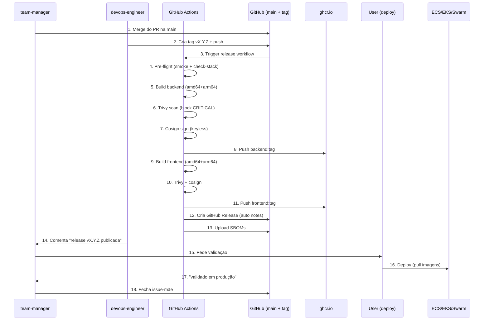

# Workflow 06 — Release Pipeline (v1.6.0+)

> **O QUÊ:** como o `devops-engineer` (e o `team-manager`) fecham
> o ciclo do meta-harness, gerando **release versionada + imagens
> Docker publicadas no GHCR** prontas para deploy em ECS/EKS/Swarm.
>
> **POR QUÊ:** sem este workflow, a issue fecha com "merge na main"
> mas **não há artefato consumível fora do repo**. O meta-harness
> entrega o framework + scaffold production-ready; este workflow
> é o último passo que **materializa** o release como binário
> utilizável.
>
> **QUANDO:** após `team-manager` rotular a issue-mãe como `done`
> (todas sub-issues done + PR mergeado + validado pelo usuário).

---

## 0. Fluxo ponta-a-ponta (Mermaid)



---

## 1. Quem faz o quê

| Persona            | Papel                                                              |
|--------------------|--------------------------------------------------------------------|
| **`team-manager`** | Coordena. Dispara `devops-engineer` quando sub-issues `done`.      |
| **`devops-engineer`** | Cria a tag. Valida que imagens foram publicadas. Comenta na issue. |
| **`CI`**           | Roda o release workflow. **Não tem persona** — é parte da infra.   |
| **User**           | Faz o deploy em produção. Valida que está funcionando.             |

---

## 2. Passo-a-passo

### 2.1. Precondições (validação antes da tag)

- [ ] Issue-mãe está com label `qa` (QA aprovou).
- [ ] PR mergeado na `main`.
- [ ] Usuário comentou "validado" no PR.
- [ ] CI do PR mergeado: 7/7 jobs verdes (lint, test, vuln,
      contract, build+image, 12-factor, i18n).
- [ ] `gh pr checks` do commit mergeado: tudo PASS.
- [ ] Sensor 09 (verify-after-build) foi aplicado pelo
      team-manager (invariante 19).

### 2.2. Criação da tag (devops-engineer)

```bash
# Garantir main local atualizado
git checkout main
git pull origin main

# Conferir último commit + SHA
git log -1 --format="%H %s"

# Conferir que CI do último commit está verde
gh pr checks $(git log -1 --format="%H")
# (para merges diretos, conferir via gh run list)

# Criar tag semver
git tag -a v0.1.0 -m "Release v0.1.0: bootstrap + first feature"
git push origin v0.1.0
```

**Convenção de tags (semver):**

- `vMAJOR.MINOR.PATCH` — release normal
- `vMAJOR.MINOR.PATCH-rc.N` — release candidate (prerelease)
- `vMAJOR.MINOR.PATCH-beta.N` — beta (prerelease)
- `vMAJOR.MINOR.PATCH-alpha.N` — alpha (prerelease)

### 2.3. Release workflow roda (CI)

O workflow
[`templates/.github-workflows-release.yml`](../../templates/.github-workflows-release.yml)
roda automaticamente ao detectar a tag.

**Stages (12 passos, ~10-15 min total):**

1. **Pre-flight sensors** — re-roda `check-stack-versions.sh` e
   `smoke-test.sh` no commit da tag. Falha = release cancelado.
2. **Build backend** — multi-arch (amd64 + arm64), parallel.
3. **Trivy scan backend** — block em CRITICAL.
4. **Cosign sign backend** — keyless via OIDC GitHub.
5. **Push backend para GHCR** — tags: `X.Y.Z`, `X.Y`, `X`,
   `sha-<commit>`, `latest` (se main).
6. **Build frontend** — idem.
7. **Trivy scan frontend** — idem.
8. **Cosign sign frontend** — idem.
9. **Push frontend para GHCR** — idem.
10. **Download SBOMs** — gerados durante o build.
11. **Create GitHub Release** — notas auto-geradas, SBOMs anexados.
12. **Prerelease flag** — `true` se tag contém `-rc`/`-beta`/`-alpha`.

### 2.4. Validação pós-release (devops-engineer)

```bash
# 1. Verificar que o release foi criada
gh release list --repo <owner>/<repo> --limit 1

# 2. Conferir que imagens foram publicadas
docker pull ghcr.io/<owner>/<repo>/backend:0.1.0
docker pull ghcr.io/<owner>/<repo>/frontend:0.1.0

# 3. Conferir tags disponíveis
gh api repos/<owner>/<repo>/packages/container/backend/versions \
  --jq '.[].metadata.container.tags | select(. != null) | .[]' | head -5

# 4. Conferir SBOM
gh release download v0.1.0 --repo <owner>/<repo> --pattern '*.spdx.json'

# 5. Conferir signature cosign
cosign verify ghcr.io/<owner>/<repo>/backend:0.1.0 \
  --certificate-identity-regexp "https://github.com/<owner>/<repo>" \
  --certificate-oidc-issuer "https://token.actions.githubusercontent.com"
```

### 2.5. Comentário na issue (team-manager)

```bash
gh issue comment <id> --body "🤖 **team-manager — release v0.1.0 publicada**

✅ **Release artifacts:**
- Backend: \`ghcr.io/<owner>/<repo>/backend:0.1.0\` (multi-arch: amd64+arm64)
- Frontend: \`ghcr.io/<owner>/<repo>/frontend:0.1.0\` (multi-arch)
- SBOMs: anexados à [Release v0.1.0](https://github.com/<owner>/<repo>/releases/tag/v0.1.0)
- Signatures: cosign (keyless OIDC)
- Trivy: 0 CRITICAL, 0 HIGH

📦 **Como usar:**
- ECS: \`aws ecs update-service --task-definition my-app-backend:1\`
- EKS: \`kubectl set image deployment/backend backend=ghcr.io/<owner>/<repo>/backend:0.1.0\`
- Swarm: \`docker service update --image ghcr.io/<owner>/<repo>/backend:0.1.0 myapp_backend\`
- Local: \`docker compose -f https://raw.githubusercontent.com/<owner>/<repo>/v0.1.0/deploy/docker-compose.yml up\`

@<user>, faça o deploy em produção. Quando validar, comente
\`validado em produção\` aqui e eu fecho a issue-mãe."
```

### 2.6. Deploy (user)

Ver [`docs/DEPLOY.md`](../../docs/DEPLOY.md) para detalhes de
ECS, EKS, Swarm, e local.

### 2.7. Validação + fechamento (team-manager)

Após o user comentar "validado em produção":

```bash
# Fechar issue-mãe
gh issue close <id> --comment "✅ Issue entregue em produção.

**Release:** v0.1.0
**Imagens:** ghcr.io/<owner>/<repo>/{backend,frontend}:0.1.0
**Deploy:** <ECS service / k8s namespace / swarm stack>
**Validação:** usuário comentou 'validado em produção'

Sub-issues:
- #2 ✅ done (backend)
- #3 ✅ done (frontend)
- #4 ✅ done (infra + release pipeline)"
```

---

## 3. Invariantes do release

- **Toda release tem tag `vX.Y.Z`** (semver strict, sem `latest`
  como tag de release).
- **Toda imagem tem SBOM SPDX** anexado à GitHub Release.
- **Toda imagem tem cosign signature** (keyless OIDC).
- **Toda imagem passa Trivy** (0 CRITICAL, 0 HIGH).
- **Multi-arch por padrão** (amd64 + arm64) — o release
  workflow constrói para ambas.
- **Tag `latest` apenas em main** (não em PRs).
- **Release notes auto-geradas** via `softprops/action-gh-release`.

---

## 4. Quem NÃO faz o quê

| Quem | NÃO faz                                                   |
|------|------------------------------------------------------------|
| `team-manager` | Não cria a tag (delega ao `devops-engineer`)      |
| `devops-engineer` | Não faz o deploy em produção (delega ao user) |
| `user` | Não cria a tag (delega ao `devops-engineer`)      |
| `CI` | Não fecha a issue (só `team-manager` faz)        |

---

## 5. Anti-patterns (NÃO faça)

| ❌ Errado                                                   | ✅ Certo                                              |
|--------------------------------------------------------------|------------------------------------------------------|
| Buildar a imagem localmente e push manual                    | Deixar CI buildar + pushar                          |
| Criar tag sem CI verde                                       | Garantir 7/7 jobs PASS antes de `git tag`            |
| Usar `latest` em produção                                    | Usar tag exata (`v0.1.0`)                            |
| Skip do Trivy (rápido)                                       | Trivy **sempre**, mesmo em hotfix                    |
| Skip do cosign (a assinatura é importante)                    | cosign **sempre** — supply-chain attack é real      |
| Esquecer de fazer o comentário na issue                      | SEMPRE postar o link da release na issue             |
| Fechar issue antes do user validar em produção               | Esperar "validado em produção"                       |

---

## 6. Referências

- [`templates/.github-workflows-release.yml`](../../templates/.github-workflows-release.yml) — o workflow em si
- [`docs/DEPLOY.md`](../../docs/DEPLOY.md) — como usar as imagens publicadas
- [Workflow 04 — Release (legacy)](./04-release.md) — versão sem GHCR
- [GHCR docs](https://docs.github.com/en/packages/working-with-a-github-packages-registry/working-with-the-container-registry)
- [cosign docs](https://docs.sigstore.dev/cosign/overview/)
- [softprops/action-gh-release](https://github.com/softprops/action-gh-release)
